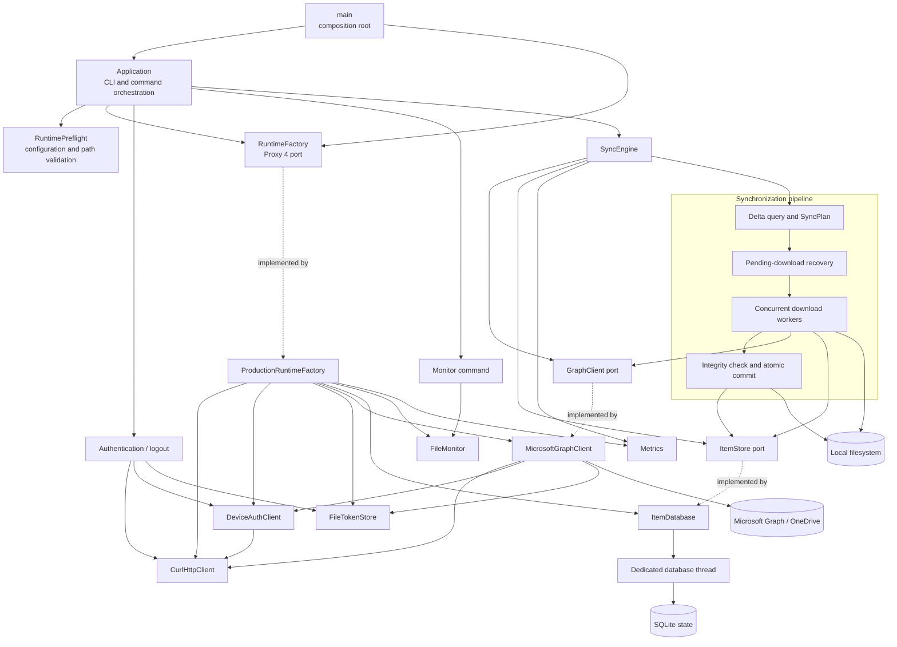

# onedrive-cpp

English | [简体中文](README.zh-CN.md)

`onedrive-cpp` is a C++26 OneDrive synchronization client scaffold for
Ubuntu 24.04 LTS and later. Its separation of responsibilities is inspired by
[abraunegg/onedrive](https://github.com/abraunegg/onedrive), but it does not
copy the reference project's D implementation.

> The current version provides a buildable architecture scaffold,
> configuration loading, a CLI, Microsoft device-code authentication, an HTTP
> transport layer, authenticated Microsoft Graph delta queries, SQLite remote
> state and delta-link persistence, safe downloads and local uploads, dry-run support, a
> systemd user service, and Debian packaging. Synchronization currently
> creates remote directories, downloads added or changed remote files, and
> safely removes unchanged local snapshots after remote deletion, uploads
> new or modified local files and directories, and conditionally propagates
> local deletions, moves, and renames. Conditional Graph operations and the
> configured local-conflict policy preserve simultaneous local and remote
> changes.

## Architecture



The application uses constructor injection and explicit port interfaces rather
than a service locator. `main` is the only composition root. The production
runtime factory creates the libcurl, file-token, SQLite, monitor, Graph, and
metrics adapters after configuration is loaded; tests inject in-memory fakes.
This keeps business orchestration independent of infrastructure and leaves a
stable metrics port for a future Linux metrics exporter.
Runtime ports use Proxy 4 type erasure, so adapters satisfy the required
operations without inheriting from project-owned abstract base classes.
The SQLite ItemStore owns a dedicated database thread. Calls from download,
monitor, and future upload workers are queued and completed synchronously, so
one thread owns the SQLite connection and transaction order while errors are
returned to the caller. SQLite is the authoritative state source; the adapter
does not maintain duplicate mutable item caches.
Download and upload transactions reuse a small template typestate core that
isolates state families and moves their payloads between legal phases. Download
uses content-verified and recovery-journaled phases; upload uses snapshot
prepared, journaled, and remote-committed phases, and only the journaled upload
can persist Graph session checkpoints. The shared template contains no Graph,
SQLite, or filesystem policy: typestates constrain in-process transitions while
SQLite remains the durable recovery authority.
Local move recovery uses the same core for prepared, journaled, recovered-
journal, staged, and installed phases. A journal is removed on failure only
while its typed state proves that no staging or destination object was
installed; later phases retain recovery evidence across restarts.
Remote moves use a separate state family for prepared, journaled, Graph-
committed, and locally committed phases. Microsoft Graph is never called until
the move journal is durable, while a successful remote move retains that
journal until the local item state and directory descendants commit atomically.

The directories correspond to the responsibilities of
`main/config/curlEngine/onedrive/sync/itemdb/monitor` in the reference project:

- `src/app`: CLI parsing, application lifecycle, and runtime dependency factory.
- `src/auth`: Device-code OAuth, token refresh, and secure token persistence.
- `src/config`: Configuration file loading and validation.
- `src/graph`: Microsoft Graph API boundary.
- `src/http`: Typed libcurl HTTP transport.
- `src/storage`: Item-store port and SQLite-persisted remote ID, ETag, and local path adapter.
- `src/sync`: Difference calculation and synchronization orchestration.
- `src/monitor`: Long-running monitor mode entry point.
- `src/metrics`: Metrics port and no-op production adapter.
- `packaging/systemd`: systemd user service.
- `debian`: Native Ubuntu/Debian package metadata.

## Supported Platforms

- Ubuntu 24.04 LTS and later.
- x86_64 or arm64, depending on the LLVM and Ubuntu build environment.
- Clang 20 with `-std=c++2c` / CMake `CXX_STANDARD 26`.
- CMake 3.28 or later.
- Development packages for CLI11, libcurl/OpenSSL, nlohmann/json, spdlog/fmt,
  SQLite, and toml++ from the system package manager.

Ubuntu 24.04 provides the required CMake, Ninja, and Clang 20 packages through
its official repositories. GCC 13 is not used because its C++26 support is not
sufficient for this project configuration.

## Set Up the Build Environment

Install the build tools from the Ubuntu 24.04 repositories:

```bash
sudo apt update
sudo apt install -y build-essential ca-certificates curl git \
  cmake ninja-build clang-20 clang-format-20 clang-tidy-20 \
  zip unzip tar pkg-config \
  libcli11-dev libcurl4-openssl-dev libfmt-dev libspdlog-dev \
  libmsgsl-dev libsqlite3-dev libssl-dev libtomlplusplus-dev \
  nlohmann-json3-dev
```

Verify the installed versions:

```bash
clang++-20 --version
clang-format-20 --version
cmake --version
```

Format modified C or C++ lines before committing. Stage the source/header
changes, then run the versioned Git integration from the repository root so it
uses the checked-in `.clang-format` without reformatting unrelated legacy
lines:

```bash
git add path/to/modified.cpp path/to/modified.hpp
git-clang-format-20 --binary clang-format-20 --staged
git add path/to/modified.cpp path/to/modified.hpp
```

New files may instead be formatted in full with `clang-format-20 -i`. Do not
use an unversioned formatter or a different major version, because its output
may differ from Clang 20.

The compiled libraries are resolved from the operating system and linked
dynamically. This lets Debian security updates replace libcurl, OpenSSL,
SQLite, spdlog, and fmt without rebuilding `onedrive-cpp`.
Proxy 4 is header-only. CMake uses an installed `msft_proxy4` package when
available and otherwise downloads the pinned ngcpp/proxy 4.1.0 release.
The vcpkg manifest resolves it through the `proxy` port.

## Build and Test Locally

After cloning the repository, change to its root directory. All build commands
below assume the project root is the current working directory.

### Release build

```bash
cmake --preset release
cmake --build --preset release
ctest --preset release
```

The executable is generated at `build/release/onedrive-cpp`. Verify it with:

```bash
./build/release/onedrive-cpp --version
./build/release/onedrive-cpp sync --dry-run
./build/release/onedrive-cpp --help
```

### Logging

Runtime diagnostics are written to standard error with `info` severity by
default. systemd captures that stream automatically:

```bash
journalctl --user -u onedrive-cpp.service -f
```

Every subcommand accepts diagnostic logging and user-output options:

```bash
onedrive-cpp sync --dry-run --log-level debug
onedrive-cpp monitor --log-file ~/.local/state/onedrive-cpp/onedrive-cpp.log
onedrive-cpp sync --dry-run --color always
onedrive-cpp sync --dry-run --output json
onedrive-cpp sync --dry-run --quiet
```

Supported levels are `trace`, `debug`, `info`, `warn`, `error`, `critical`,
and `off`. A configured log file rotates at 5 MiB and retains three older
files. Authentication tokens, device codes, and authorization headers must
never be written to logs.

`--color=auto` is the default: styling is enabled only for a terminal and is
disabled when `NO_COLOR` is set. `always` forces ANSI styling and `never`
disables it. `--output=json` emits one compact JSON object per line and never
emits ANSI sequences; destructive interactive confirmation requires `--yes`
in this mode. `--quiet` suppresses informational and success output while
retaining warnings and errors. Diagnostic logs remain on standard error, while
command results are written to standard output.

### Shell completion

The package installs Bash and Zsh completion definitions for subcommands,
options, enumerated values, and file paths. New shell sessions load them
automatically when the shell completion system is enabled.

For a development build, enable Bash completion in the current shell with:

```bash
source packaging/completions/onedrive-cpp.bash
```

Then use Tab completion for commands and values:

```bash
build/release/onedrive-cpp <Tab>
build/release/onedrive-cpp sync --<Tab>
build/release/onedrive-cpp sync --log-level <Tab>
```

The installed definitions are placed in
`share/bash-completion/completions/onedrive-cpp` and
`share/zsh/vendor-completions/_onedrive-cpp`.

### Manual page

The CMake install rules place the section 1 manual at the standard
`share/man/man1` location. After installing the DEB package, view it with:

```bash
man onedrive-cpp
```

Debian's `man-db` trigger updates the index automatically. After a direct
`cmake --install` into a custom prefix, refresh the local index when needed:

```bash
sudo mandb
```

The generated page can also be inspected without installing it:

```bash
man --local-file build/release/generated/onedrive-cpp.1
```

### Clean Release rebuild

Delete only the Release build tree to force CMake and Ninja to reconfigure and
rebuild it from scratch:

```bash
rm -rf build/release
cmake --preset release
cmake --build --preset release
ctest --preset release
./build/release/onedrive-cpp sync --dry-run
```

Ninja builds in parallel automatically. To set an explicit job count:

```bash
cmake --build --preset release --parallel 4
```

### Debug build

The Debug tree is independent of the Release tree:

```bash
rm -rf build/debug
cmake --preset debug
cmake --build --preset debug
ctest --preset debug
```

The Debug executable is generated at `build/debug/onedrive-cpp`.

### Live Microsoft Graph E2E test

The `e2e` preset is disabled from normal builds and requires a dedicated test
account or Drive whose remote root contains a stable fixture. The external
configuration must already be authenticated and must not be committed. The
runner copies its state directory into an isolated temporary workspace, clears
only that copy, and configures an isolated `sync_list`. It verifies that an
explicit single-file download bypasses an empty list, that the following sync
excludes its snapshot without deleting the local file, that adding an inclusion
rule triggers a full remote-state query and re-downloads the fixture, and that
the next incremental synchronization does not replace the unchanged file. It
then writes conflicting local content, clears only the isolated state copy, and
verifies that `sync.local_conflict = "backup"` emits its structured event,
preserves the exact local bytes in one same-directory `safeBackup`, restores
the authoritative Graph fixture, persists one snapshot, and leaves both files
unchanged during the following incremental synchronization. The runner forces
the isolated configuration to use the `backup` policy; it does not modify the
external configuration. It also creates a disposable local subtree and verifies
remote directory creation, simple upload, an upload-session file larger than
250 MB, completed-upload recovery, simultaneous local/remote conflict backup,
local moves into new parents, and local deletion. The large fixture defaults to
250,000,001 bytes; `ONEDRIVE_E2E_LARGE_UPLOAD_BYTES` may increase it up to 1 GB
but cannot lower it below the upload-session threshold. It then uses the copied
account token to create another uniquely named disposable Graph subtree, moves
and renames a file and a directory across remote parents, and verifies that
synchronization reuses the same local inodes, updates snapshots, emits
structured move events, and removes the fixture after remote cleanup. Temporary
remote subtrees are deleted even when the test fails. Finally, the runner
injects an isolated trusted snapshot
whose ID is absent from a real full Graph Delta response and verifies safe
local deletion, SQLite cleanup, structured output, and preservation of the
live fixture. It also enables `sync_root_files`, verifies that the selection
fingerprint forces a full Graph query, and confirms the existing rule-selected
fixture is not rewritten.

```bash
export ONEDRIVE_E2E_CONFIG=/absolute/path/to/dedicated-e2e.toml
export ONEDRIVE_E2E_EXPECTED_PATH=fixture/small.bin
export ONEDRIVE_E2E_EXPECTED_SHA256=<64-lowercase-hex-digits>
# Optional; must remain above 250,000,000 and no greater than 1,000,000,000.
export ONEDRIVE_E2E_LARGE_UPLOAD_BYTES=250000001

cmake --preset e2e
cmake --build --preset e2e
ctest --preset e2e -R graph_sync_e2e
```

The dedicated Drive must grant file write access and should contain only
disposable test data even though the runner's generated `sync_list` materializes
only the expected and temporary fixtures. Allow enough local free space for
both the large source and its stable upload snapshot, and enough test-account
quota for the remote copy. Set
`ONEDRIVE_E2E_ARTIFACT_DIR` to retain command output and the client log after a
failure. These diagnostics may contain remote file metadata and must be handled
as sensitive data. Configuration, copied tokens, SQLite state, and downloaded
content are always removed. Never point the E2E runner at a daily-use state or
Drive.

The live runner also exercises system boundaries with the real executable:
connections dropped by a local proxy and subsequent recovery, deterministic
local upload-storage exhaustion and recovery, unreadable upload sources,
`SIGKILL` during a resumable upload, and an inotify-triggered monitor upload
followed by clean `SIGTERM` shutdown. Run it as a non-root user; the permission
scenario depends on ordinary Unix access checks. CMake also requires the
`stdbuf` command so monitor JSON events are observable without changing
production buffering.

Each boundary is a separate CTest entry. Run all five with:

```bash
ctest --test-dir build/e2e --output-on-failure -L boundary
```

### C++ Core Guidelines checks

The lint preset runs Clang-Tidy during compilation with the project
`.clang-tidy` policy. Diagnostics from the Clang static analyzer, bug-prone,
performance, portability, and selected C++ Core Guidelines checks are treated
as build errors:

```bash
cmake --preset lint
cmake --build --preset lint
```

The policy excludes only reviewed noise from required C/POSIX APIs, protocol
constants, and checked buffer boundaries. Microsoft GSL is used to express
non-null borrowed dependencies at API and RAII boundaries. ngcpp/proxy
provides type-erased runtime ports with explicit owning and borrowed adapters.

## Build DEB Packages

### Quick CPack package

Use CPack to quickly create a package that has not undergone full Debian
policy checks:

```bash
cpack --config build/release/CPackConfig.cmake -G DEB
```

The generated package is placed in the current directory. CMake reads
`ID` and `VERSION_ID` from `/etc/os-release`, so an Ubuntu 24.04 amd64 build
is named:

```text
onedrive-cpp_0.5.0-1~ubuntu24.04_amd64.deb
```

For a cross-distribution build environment, override the detected suffix
explicitly during configuration:

```bash
cmake --preset release \
  -DONEDRIVE_PACKAGE_DISTRIBUTION=ubuntu26.04
```

Packages for Ubuntu 26.04 must still be built and tested in an Ubuntu 26.04
environment; changing the suffix does not change the binary ABI.

### Official Debian package

Install the packaging dependencies:

```bash
sudo apt install -y build-essential devscripts debhelper ninja-build clang-20
```

Run the following commands from the project root:

```bash
source "$HOME/.profile"
chmod +x debian/rules
dpkg-buildpackage --build=binary --no-sign
```

`dpkg-buildpackage` configures the project with CMake, builds it, and runs the
tests. The generated `.deb` is placed in the parent directory of the project,
for example:

```text
../onedrive-cpp_0.5.0-1~ubuntu24.04_amd64.deb
```

The Debian changelog carries the native build distribution suffix. When
adding Ubuntu 26.04 support, build from an Ubuntu 26.04 environment with a
`0.5.0-1~ubuntu26.04` changelog version.

Install and verify the package:

```bash
version=$(dpkg-parsechangelog -S Version)
architecture=$(dpkg --print-architecture)
sudo apt install "../onedrive-cpp_${version}_${architecture}.deb"
onedrive-cpp --version
man onedrive-cpp
```

To check for Debian policy issues:

```bash
sudo apt install -y lintian
lintian "../onedrive-cpp_${version}_${architecture}.changes"
```

## Configuration and systemd

By default, the application first reads `~/.config/onedrive-cpp/config.toml`. If
that file does not exist, built-in defaults are used. A system-wide example is
installed at `/etc/onedrive-cpp/onedrive-cpp.toml`. To create a user
configuration:

```bash
mkdir -p ~/.config/onedrive-cpp
cp /etc/onedrive-cpp/onedrive-cpp.toml ~/.config/onedrive-cpp/config.toml
sed -i "s|/home/USER|$HOME|g" ~/.config/onedrive-cpp/config.toml
```

Configuration files use TOML and must declare `config_version = 2`. Version 1
files must move their former `sync.download_*` keys into the `transfer` and
`download` tables shown below. Unknown keys and invalid value types are
rejected instead of being silently ignored.

Before running a command, the client secures `state.directory` to owner-only
`0700`, validates the active account token path, and acquires an exclusive
`onedrive-cpp.lock` in that directory. A second process using the same state
directory fails immediately. Existing private state files are tightened to
`0600` when owned by the current user; symbolic links and files owned by
another user are rejected.

For synchronization, `sync.directory` and `state.directory` must not contain
one another, the filesystem root cannot be used as the sync directory, and
every existing path component must be free of symbolic links. Normal sync
performs a create/write/fsync/remove probe before contacting Graph. Dry-run
keeps its non-mutating sync-directory behavior. Downloads also reserve the
larger of 256 MiB or 5% of the actual transfer as a safety margin. Concurrent
workers reserve only their remaining bytes before transfer, release promised
space at each durable checkpoint, and wait when another active download owns
the currently available capacity. This permits large batches to proceed
sequentially without allowing concurrent downloads to overcommit the disk.

`sync.drive_id` selects the remote OneDrive drive to access. The default value,
`me`, selects the signed-in user's default OneDrive and lists its root through
the Microsoft Graph path `/me/drive/root/children`. To access another OneDrive
or a SharePoint document library available to the account, set the actual
Drive ID instead; the client then uses `/drives/<drive_id>/root/children`.
For example:

```toml
[sync]
# Default OneDrive of the signed-in user
drive_id = "me"
permissions = "private"
local_conflict = "block"
# Optional; resolved relative to this TOML file
# sync_list = "sync_list"
sync_root_files = false
upload = true
maximum_remote_deletions = 1000

# Another OneDrive or SharePoint document library
# drive_id = "b!YOUR_DRIVE_ID"

# Optional; applies to authentication, Graph API, and file downloads
# [proxy]
# url = "socks5h://127.0.0.1:1080"
# no_proxy = ["localhost", "127.0.0.1", ".internal.example.com"]
# username = "proxy-user"
# password_file = "/run/secrets/onedrive-proxy-password"
# auth = "auto"
# ca_file = "/etc/ssl/certs/company-proxy-ca.pem"

[transfer]
order = "default"
connect_timeout_seconds = 30
operation_timeout_seconds = 3600
stall_timeout_seconds = 60
stall_minimum_bytes_per_second = 1
http_version = "auto"
ip_version = "auto"

[download]
concurrency = 4
maximum_retries = 4
chunk_threshold_bytes = 8388608
checkpoint_interval_bytes = 1048576
maximum_rate_bytes_per_second = 0
maximum_total_rate_bytes_per_second = 0
validation = "strict"

[upload]
# Files through 250 MB (250,000,000 bytes) use a simple upload. Larger files
# use an upload session with the fragment size below.
chunk_size_bytes = 10485760
maximum_rate_bytes_per_second = 0
maximum_total_rate_bytes_per_second = 0

[monitor]
poll_interval_seconds = 300
settle_delay_milliseconds = 1000
```

`sync.maximum_remote_deletions` limits how many tracked items one local
deletion plan may remove from OneDrive. The default is `1000`; `0` blocks every
remote deletion unless explicitly overridden. A missing tracked directory
counts itself and every tracked descendant it would remove, even though Graph
needs only one DELETE request for the parent. The client checks the complete
batch before upload-side moves, directory creation, uploads, or deletes, and
checks it again immediately before deletion execution.

When the limit is exceeded, normal sync and monitor runs stop before issuing a
remote DELETE. Monitor never bypasses the guard. `sync --dry-run` reports the
Graph operation count, affected tracked-item count, configured limit, and
whether a normal run would be blocked. After reviewing the local filesystem,
an intentional one-shot batch can be approved with:

```bash
onedrive-cpp sync --force-large-delete
```

The override applies only to that invocation and cannot be persisted in the
configuration file. Existing pending-delete recovery is protected by the same
limit, so restarting the process cannot bypass the safeguard.

`monitor` performs an initial synchronization and then remains idle until
inotify reports a completed local change or the Graph polling interval expires.
Local event bursts are coalesced for `monitor.settle_delay_milliseconds`.
`monitor.poll_interval_seconds` bounds how long remote changes can remain
undetected when there is no local activity. Newly created and moved directory
trees are watched recursively; an inotify queue overflow rebuilds every watch
and schedules a complete synchronization. `SIGINT` and `SIGTERM` wake the
blocking wait and stop cleanly after the active synchronization finishes.

`sync.sync_list` enables client-side selective synchronization. It names a
separate UTF-8 rule file; relative paths are resolved from the directory
containing the TOML configuration file. If the setting is absent, all remote
items are eligible for synchronization. If it is present, the file must be
readable, and an empty rule file selects no remote items.

The rule file excludes everything by default and supports:

- blank lines and lines beginning with `#`;
- inclusion rules such as `/Documents/` or `Pictures/*.jpg`;
- exclusion rules beginning with `!` or `-`;
- a leading `/` to anchor a rule at the Drive root;
- a trailing `/` to restrict a rule to directories and their descendants;
- `*` within one path segment and `**` as a complete recursive segment.

For example:

```text
# Include Documents but omit private content and temporary files
/Documents/
!/Documents/Private/*
!/Documents/**/*.tmp

# Include matching pictures at any directory depth
Pictures/*.jpg
```

Exclusions override inclusions. The client retains the directory ancestors
needed to materialize selected files. Rules without a leading `/` may match at
any depth and therefore have broader semantics. Backslashes, empty path
components, `.` and `..`, and `**` embedded within another segment are
rejected.

Filtering is performed after Microsoft Graph returns Delta metadata; it
reduces local materialization and file transfers but does not provide
server-side Graph filtering. A fingerprint of the effective rules is committed
atomically with the Delta cursor. Adding, changing, removing, or reordering
rules automatically causes the next synchronization to fetch the full remote
state. Excluded files already present locally are deliberately retained because
selection changes are not remote deletion records. When a tracked file moves
from an included path to an excluded path, schema-v16 SQLite state binds an
upload suppression to the retained object's device/inode identity. The same
object is not uploaded again from its old path, even after local modification.
If it disappears or a different filesystem object replaces it, the stale
suppression is removed during the next upload scan. Moving the remote item back
into the selected set downloads its current path without releasing protection
for the retained old copy. The explicit `download REMOTE_PATH` command is not
restricted by `sync.sync_list`.

When `sync.sync_list` is configured, `sync.sync_root_files = true`
automatically includes ordinary files located directly in the Drive root.
Root directories and their descendants still require an inclusion rule, and
an exclusion rule such as `!/root-secret.txt` overrides the automatic
inclusion. The default is `false`; without `sync.sync_list`, the setting has no
effect because normal synchronization already includes all files. Changing
this value changes the selective-sync fingerprint and therefore triggers a
full remote-state query before the new selection is committed.

`sync.local_conflict` controls simultaneous local and remote file changes.
The default, `"block"`, preserves the existing behavior: synchronization
records the item as `local_modification`, and explicit single-file download
stops without downloading. Set it to `"backup"` to copy the stable local
contents to a durable same-directory name such as
`report.safeBackup-20261004T051000Z-0001.pdf` before atomically installing the
authoritative remote version. The copy is independent rather than a hard link,
retains the local permission bits, and is excluded from upload. If local and
downloaded contents have the same SHA-256
fingerprint, the existing file is adopted without creating a backup or
replacing its inode. Backup creation requires additional disk space equal to
the local file and fails safely without replacing the destination. This policy
applies to normal synchronization, `download REMOTE_PATH`, and an upload
recovery that discovers a simultaneous remote change. Such a recovery
discards only its stale upload snapshot and journal, then reconciles the
remote delta through the same policy. Directory and remote-deletion conflicts
that cannot produce a safe regular-file copy remain blocked.

For tracked files, the state database stores both Graph eTag and cTag values.
When the local snapshot is unchanged and a delta changes only the eTag while
retaining the same non-empty cTag, synchronization refreshes the remote
metadata without downloading the file again. A missing or changed cTag falls
back to the conservative eTag behavior and downloads the remote content.
Folder decisions do not rely on cTag because SharePoint and OneDrive for
Business may omit it or report descendant changes inconsistently.

`sync.upload` defaults to `true`. After remote changes are applied, normal
synchronization uploads new and modified local regular files selected by the
same sync-list rules. New files use fail-on-conflict creation; tracked files
use their saved eTag as an `If-Match` precondition. Symbolic links, reserved
safeBackup and transfer-temporary names, blocked remote paths, and type
conflicts are never uploaded. Each transfer uses a stable private snapshot and
a durable SQLite pending-upload journal. Recovery verifies an already-created
remote file by downloading it and comparing SHA-256 before committing state.
Selected untracked local directories are created remotely in parent-first
order before their files. Directory creation uses fail-on-conflict semantics
and the same durable journal. A definite Graph conflict removes the journal
and blocks the operation; after an ambiguous interruption, recovery retries
the request and adopts an existing item only when it is a directory at the
exact expected path.
Files through 250 MB use a simple upload. Larger files use a Microsoft Graph
upload session with contiguous fragments and advance only to the exact
`nextExpectedRanges` offset confirmed by Graph. The default fragment size is
10 MiB; non-final fragments are a multiple of 320 KiB and remain below Graph's
60 MiB request limit. Upload-session URLs are preauthorized and therefore never
receive the Graph Authorization header or appear in logs. The pending-upload
journal persists the session URL, expiration, and each offset confirmed by
Graph. After a restart, the client queries the session without an Authorization
header, accepts Graph progress ahead of the last local checkpoint, and resumes
without resending confirmed fragments. Expired sessions and HTTP 404/410
responses create a new session; a server offset behind the durable checkpoint
stops the upload instead of risking duplicate data. Set `upload = false` to
retain download-only behavior.

OneDrive quota responses and local upload read, permission, snapshot-space,
or I/O failures are recorded in the same pending-upload journal with an
actionable reason and attempt count. One failed item does not stop unrelated
uploads. The client retries each recorded failure once per synchronization;
successful recovery clears the journal, while repeated failures remain
visible in warnings and the blocked summary.

Missing tracked local items are deleted remotely with their saved eTag as an
`If-Match` precondition. Directory deletions are parent-first and cover their
tracked descendants. A dedicated SQLite journal makes an already-completed
Graph deletion recoverable after a process interruption; HTTP 404 is therefore
an idempotent success, while 409/412 stops without discarding tracked state.
Dry-run and paths outside the active sync-list never issue deletions.
Tracked local files and directories also persist their filesystem device and
inode identity. Downloads and uploads record it immediately, while a normal
non-dry-run upload scan backfills older snapshots. This stable identity is the
basis for safely recognizing local moves without relying on ambiguous size and
timestamp matches. A recognized move uses the saved eTag in a conditional
Graph PATCH and a dedicated SQLite journal. File modifications made together
with a move are uploaded after the move commits. Directory moves remap tracked
descendants atomically. Restart recovery adopts the destination only when its
remote ID and local filesystem identity both match. The destination parent
may be newly created locally: synchronization creates each missing remote
parent from shallowest to deepest before issuing the conditional move. Parent
creation and the move retain their separate durable journals.

`graph.endpoint` selects the Microsoft Graph cloud endpoint and defaults to
the global service. It is not tied to a specific SharePoint host. For a
SharePoint library in the Microsoft 365 China cloud, configure both the Graph
and authentication cloud endpoints:

```toml
[auth]
endpoint = "https://login.chinacloudapi.cn"

[graph]
endpoint = "https://microsoftgraph.chinacloudapi.cn/v1.0"
```

The optional `proxy.url` setting routes authentication, Microsoft Graph, and
file-download requests through one proxy. Supported URL schemes are `http`,
`https`, `socks4`, `socks4a`, `socks5`, and `socks5h`. Use `socks5h` rather
than `socks5` when destination host names must be resolved by the proxy:

```toml
[proxy]
url = "https://proxy.example.com:8443"
no_proxy = ["localhost", "127.0.0.1", ".internal.example.com"]
username = "proxy-user"
password_file = "/run/secrets/onedrive-proxy-password"
auth = "auto"
ca_file = "/etc/ssl/certs/company-proxy-ca.pem"

# Or use remote DNS through SOCKS5:
# url = "socks5h://127.0.0.1:1080"
```

The complete proxy configuration defaults are:

- `proxy.url`, `proxy.no_proxy`, `proxy.username`, `proxy.password_file`, and
  `proxy.ca_file` are unset;
- `proxy.auth` defaults to `auto`;
- because `proxy.url` is unset, the application does not explicitly select a
  proxy, but libcurl can still use `HTTP_PROXY`, `HTTPS_PROXY`, `ALL_PROXY`,
  and their lowercase variants from the environment;
- because `proxy.no_proxy` is unset, libcurl uses `NO_PROXY`/`no_proxy` from
  the environment;
- without `proxy.ca_file`, HTTPS proxies use the system CA trust store.

To guarantee direct connections, omit the `[proxy]` table and unset all proxy
environment variables. To use a configured proxy for every destination
regardless of `NO_PROXY`, set `no_proxy = []`.

`proxy.no_proxy` is an array of hosts, domain suffixes, IP addresses, or other
libcurl no-proxy patterns. When omitted, libcurl's `NO_PROXY`/`no_proxy`
environment variable remains effective. An explicitly empty array overrides
the environment and sends every destination through the proxy.

`proxy.username` enables proxy credentials. Store the corresponding password
in `proxy.password_file` instead of the TOML file or proxy URL. Relative
password paths resolve from the TOML file's directory. The password file must
be a regular file reached without symbolic links, must grant no group or other
permissions, and must not exceed 64 KiB. One trailing LF or CRLF is removed.
An empty password, embedded NUL byte, or password file without a username is
rejected.

`proxy.auth` controls HTTP/HTTPS proxy authentication and accepts `auto`,
`basic`, `digest`, `ntlm`, or `negotiate`; it defaults to `auto`. SOCKS5 uses
its own username/password authentication. Authentication mechanisms actually
available depend on the installed libcurl build.

`proxy.ca_file` adds a certificate-authority file for an HTTPS proxy and is
rejected for other proxy schemes. Relative paths resolve from the TOML file's
directory. Proxy certificate and host verification remain enabled and cannot
be disabled by configuration. Keep credentials out of `proxy.url` because
configuration or error diagnostics may expose URLs.

`download.concurrency` controls how many files can be downloaded at the same
time. It defaults to `4` and accepts values from `1` through `16`. Downloads
targeting the same normalized local path are always serialized, including
common ASCII case-only path variants, while unrelated destinations remain
concurrent.

`transfer.order` controls the order in which file transfers enter the worker
queue. Supported values are `default`, `size_asc`, `size_dsc`, `name_asc`, and
`name_dsc`. The default preserves synchronization-plan order. Equal sort keys
also preserve plan order. With concurrent workers this controls start order,
not completion order. The setting currently applies to downloads and is shared
so future upload support can use the same policy.

`download.chunk_threshold_bytes` sets the large-file threshold in bytes. Files
larger than this value are downloaded sequentially with HTTP byte-range
requests, using the same value as the maximum chunk size. It defaults to
`8388608` (8 MiB) and must be greater than zero. Files at or below the
threshold use a single request. Range response metadata is validated before
response bytes are written. Single-request and relaxed downloads likewise
reject non-success HTTP response bodies before they can reach the temporary
file or a durable checkpoint. The Graph content request uses the expected
remote eTag as an `If-Match` precondition, so a changed remote version is
rejected before a download URL is issued. Large transfers periodically flush durable
checkpoints so an interrupted request retries from the last safely stored
offset instead of the beginning of the chunk. Graceful cancellation also
flushes and records bytes from an already validated Range response before
stopping.

`download.checkpoint_interval_bytes` controls how many newly downloaded bytes
are written durably before resumable progress is recorded. It defaults to
`1048576` (1 MiB) and must be greater than zero. Smaller values reduce
re-download work after interruptions but increase synchronization and database
overhead.

`download.maximum_retries` controls how many times a file-content request is
retried after a transient HTTP or transport failure. It defaults to `4`;
`0` disables file-content retries. This is independent of
`graph.throttle.maximum_retries`, which continues to control Microsoft Graph
API request retries. Download retries use the Graph backoff delay settings.

Shared `transfer` settings control each file-content request and are also
used by uploads. Connection and operation timeouts default to `30`
and `3600` seconds. A transfer that remains below
`transfer.stall_minimum_bytes_per_second` (default `1`) for
`transfer.stall_timeout_seconds` (default `60`) is aborted; set the stall
timeout to `0` to disable this check.
`download.maximum_rate_bytes_per_second` limits each individual file-content
request and defaults to `0`, meaning unlimited.
`download.maximum_total_rate_bytes_per_second` limits the combined receive
rate shared by all concurrent file downloads and also defaults to `0`.
When both are non-zero, each request is subject to the individual limit while
all active requests share the total limit. The total limiter uses a fair,
cancellable token bucket with a burst of at most 64 KiB. Throttling time counts
toward `transfer.operation_timeout_seconds` and may contribute to libcurl's
stall detection, so very low rate limits may require a longer operation or
stall timeout.
`upload.maximum_rate_bytes_per_second` limits each upload request's send rate
and defaults to `0`. `upload.maximum_total_rate_bytes_per_second` supplies a
combined ceiling and also defaults to `0`; because uploads currently run
sequentially, the effective limit is the lower non-zero value. The default
`upload.chunk_size_bytes` is 10 MiB and must be a positive multiple of 320 KiB
below 60 MiB.
`transfer.http_version` accepts `"auto"`, `"1.1"`, or `"2"`; HTTP/2 is
negotiated over TLS and may fall back according to libcurl capabilities.
`transfer.ip_version` accepts `"auto"`, `"4"`, or
`"6"` and defaults to `"auto"`; forcing an address family can work around
broken IPv6 or IPv4 routing, but fails when the download host has no address in
that family. Preauthenticated download URLs can follow at most five additional
redirects, all of which must use HTTPS; Graph authorization is never attached
to those CDN requests. Each download worker safely reuses its reset libcurl easy handle,
allowing DNS, TCP, TLS, and HTTP/2 connection state to be reused across chunks,
retries, and subsequent files without carrying request headers, bodies, or
callbacks between operations. Trace logging reports the negotiated HTTP
version, number of newly opened connections, and DNS, TCP, TLS, server wait,
body-transfer, and total timings in microseconds. These diagnostics do not
include request URLs, headers, or bodies.

Download progress reports aggregate all active files and include the current
smoothed transfer rate and estimated time remaining. The final report includes
the total elapsed download time. JSON progress events expose the same values as
`bytes_per_second`, `estimated_seconds_remaining`, and
`elapsed_milliseconds`.

`download.validation` defaults to `"strict"`, which requires downloaded size
and any Graph-provided content hash to match the remote metadata. Some
SharePoint, Azure Information Protection (AIP), and HEIC files are served with
bytes that differ from their Graph metadata. `"relaxed"` accepts those files,
but disables resumable/chunked downloads and remote size/hash verification.
HTTP success, durable writes, atomic installation, and the local SHA-256
recovery fingerprint remain enforced. Disk space is reserved incrementally
from actual transfer progress rather than untrusted Graph size metadata, and
the transfer is aborted if the reservation cannot grow safely. Because Graph
cannot reliably identify AIP-protected files in advance, relaxed mode applies
to all downloads and weakens integrity guarantees.

`permissions` defaults to `"private"`. New synchronized files are created as
`0600`, and the synchronization root and new directories are secured as
`0700`, so other local users cannot read synchronized content. Set it to
`"umask"` only when synchronized data must intentionally follow the process
umask, such as a directory shared through Unix group permissions. The packaged
systemd user service also uses `UMask=0077` as defense in depth.

`sync.directory` is the common root for synchronized data. Actual Drive
contents are isolated with the same stable, friendly account and Drive
components used by state:

```text
<sync.directory>/accounts/<display-name>--<user-id-hash>/
  drives/<drive-name>--<drive-id-hash>/
    <synchronized OneDrive contents>
```

This allows one configured root to hold multiple Microsoft users and multiple
Drives without path collisions. Existing files in the former flat
`<sync.directory>` layout are not moved automatically and remain untouched.

State is separated by the stable Microsoft user ID and canonical Drive ID while
retaining friendly directory names:

```text
<state.directory>/accounts/<display-name>--<user-id-hash>/
  account.json
  avatar.<image-extension>
  refresh_token
  drives/<drive-name>--<drive-id-hash>/
    drive.json
    items.sqlite3
```

The account and Drive metadata use stable ID hashes so display-name changes do
not create a second state tree. The Drive database stores and validates the
user ID, display name, canonical Drive ID, Drive name, profile-photo MIME type,
and profile-photo bytes in addition to remote IDs, ETags, and local paths.
Its `drive_mapping` table records the configured selector and resolved ID, for
example `me` to the canonical Microsoft Drive ID. SQLite uses WAL mode.

The former flat `<state.directory>/items.sqlite3` and
`<state.directory>/refresh_token` layout is intentionally not migrated. Run
`onedrive-cpp auth` again to initialize the account-based layout and rebuild
synchronization state.

### Microsoft authentication

The client uses the OAuth 2.0 Device Authorization Grant. You must register
your own public client application in Microsoft Entra; do not create a client
secret.

#### Register the application

Microsoft currently requires an Azure account with an active subscription,
access to a Microsoft Entra tenant, and permission to register applications.
If you only have a personal Outlook.com/Hotmail account and cannot open
**App registrations**, create a
[free Azure account](https://azure.microsoft.com/pricing/purchase-options/azure-account)
and use its **Default Directory**, or ask the tenant administrator for the
Application Developer role.

1. Sign in to the
   [Microsoft Entra admin center](https://entra.microsoft.com/).
2. Open **Entra ID > App registrations > New registration**.
3. Enter a name such as `onedrive-cpp`.
4. Select the supported account type:
   - For both work/school and personal Microsoft accounts, select
     **Any Entra ID Tenant + Personal Microsoft accounts** and later use
     `auth.tenant_id = "common"`.
   - For personal Microsoft accounts only, select **Personal accounts only**
     and later use `auth.tenant_id = "consumers"`.
   - For one organization only, select **Single tenant**, then use that
     directory's tenant ID instead of `common`.
5. Select **Register**.
6. On the application **Overview** page, copy the **Application (client) ID**.
   Do not copy the Object ID or Directory ID into `auth.application_id`.
7. Open **Authentication > Advanced settings**, set
   **Allow public client flows** to **Yes**, and save.

Device code flow does not require a redirect URI. Because this is a public
client, do not add a client secret: a secret embedded in a desktop or CLI
application cannot be kept confidential.

Microsoft's corresponding documentation is:

- [Register an application in Microsoft Entra ID](https://learn.microsoft.com/en-us/entra/identity-platform/quickstart-register-app)
- [Configure desktop and public client applications](https://learn.microsoft.com/en-us/entra/identity-platform/scenario-desktop-app-configuration)
- [OAuth 2.0 device authorization grant](https://learn.microsoft.com/en-us/entra/identity-platform/v2-oauth2-device-code)

#### Configure permissions

Open **API permissions > Add a permission > Microsoft Graph > Delegated
permissions**.

For a personal OneDrive account, configure these delegated permissions:

```text
User.Read
Files.ReadWrite
```

`User.Read` allows the client to identify the signed-in account and download
its profile photo. The client also requests `offline_access` so Microsoft can
issue a refresh token. For organizational OneDrive, shared libraries, and SharePoint
scenarios, add the broader delegated permissions only when required:

```text
Files.ReadWrite.All
Sites.ReadWrite.All
```

Organizational tenant policies may require an administrator to grant consent.
Personal Microsoft accounts normally grant consent during device sign-in.
See the
[Microsoft Graph permissions reference](https://learn.microsoft.com/en-us/graph/permissions-reference)
for the current permission definitions.

#### Configure onedrive-cpp

Create the user configuration if it does not already exist:

```bash
mkdir -p ~/.config/onedrive-cpp
cp /etc/onedrive-cpp/onedrive-cpp.toml ~/.config/onedrive-cpp/config.toml
sed -i "s|/home/USER|$HOME|g" ~/.config/onedrive-cpp/config.toml
```

For an application registered as **Personal Microsoft accounts only**, use:

```toml
[auth]
application_id = "YOUR_APPLICATION_CLIENT_ID"
tenant_id = "consumers"
endpoint = "https://login.microsoftonline.com"
scopes = ["User.Read", "Files.ReadWrite", "offline_access"]
```

For an application registered as **Any Entra ID Tenant + Personal Microsoft
accounts**, use `common` even when the user signing in has a personal account:

```toml
[auth]
application_id = "YOUR_APPLICATION_CLIENT_ID"
tenant_id = "common"
endpoint = "https://login.microsoftonline.com"
scopes = ["User.Read", "Files.ReadWrite", "offline_access"]
```

For a single-tenant organizational application, replace `common` with the
tenant's Directory (tenant) ID. Add `Files.ReadWrite.All` or
`Sites.ReadWrite.All` only for organizational scenarios that require them;
`Sites.ReadWrite.All` is not supported for personal Microsoft accounts. The
default scopes are `User.Read Files.ReadWrite offline_access`; authentication
prints a warning when either broader organizational scope is configured.

#### Authorize the client

Run the device authorization flow:

```bash
onedrive-cpp auth
```

Open the displayed URL, enter the user code, sign in with the account matching
the registration's supported account type, and review the requested
permissions. On success, the client retrieves the stable user and Drive
identities plus the profile photo. The refresh token and photo are atomically
saved under the friendly account state directory with owner-only permissions.

If Microsoft reports that the account is unsupported, verify the selected
**Supported account types** and use `consumers` for personal-only
registrations or `common` for combined personal and organizational
registrations.

If the program displays `https://www.microsoft.com/link` and that page
immediately reports that a newly generated code is invalid or expired, check
whether a combined personal and organizational application was incorrectly
configured with `auth.tenant_id = "consumers"`. Change it to:

```toml
[auth]
tenant_id = "common"
```

Start `onedrive-cpp auth` again and use only the newly generated code at the
newly displayed `https://login.microsoft.com/device` URL. Previously generated
device codes cannot be reused. Keep `consumers` only for applications whose
supported account type is **Personal Microsoft accounts only**.

If the device code is accepted and account sign-in begins, but Microsoft then
reports that the code expired while the terminal remains at
`Waiting for authorization...`, remove permissions that are unavailable to
the selected account type. In particular, personal Microsoft accounts should
use:

```toml
[auth]
scopes = ["User.Read", "Files.ReadWrite", "offline_access"]
```

After changing scopes, restart `onedrive-cpp auth`; an existing device code
retains its original scopes and cannot be repaired or reused.

Remove the saved authentication with:

```bash
onedrive-cpp logout
```

Reset the saved `deltaLink` for the configured drive with:

```bash
onedrive-cpp reset-state
```

This preserves authentication tokens, configuration, local files, item
snapshots, pending-download, pending-upload, and pending-move recovery records,
selectively retained upload suppressions, and state for other drives. The next
`sync` recovers pending operations first, then performs a full initial Delta
query. Existing snapshots are used to detect local modifications safely;
blocked-item records are preserved for diagnosis, and the complete remote
inventory replaces the configured Drive's old item metadata.

During a Delta query, text output and logs report each completed page and the
cumulative number of scanned items. JSON output emits a `delta_progress` event
with `pages`, `items`, and `completed` fields. Microsoft Graph does not provide
the total number of Delta items in advance, so an accurate percentage is not
available. `--quiet` suppresses console progress but not configured log output.

Before creating directories or downloading files, synchronization validates
every remote path. Empty, absolute, dot-segment, NUL-containing, control-byte,
and empty components are rejected. Component and complete-path byte lengths
are checked against the target filesystem limits. The error identifies the
remote path, offending component, actual size, and supported limit; control
bytes are escaped so diagnostics remain safe to display. Invalid names are
persisted as blocked items while independent files continue synchronizing.
They are retried automatically and normally require renaming in OneDrive.

To discard all saved synchronization state for the configured Drive, use the
explicitly destructive mode:

```bash
onedrive-cpp reset-state --clear-all
```

The command requires the configured Drive reference (for example, `me`) to be
typed exactly before it removes item snapshots, the Delta cursor,
pending-download, pending-upload, pending-move recovery records, selectively
retained upload suppressions, and blocked items. If no configured reference is
available, it requires the raw Drive ID instead. Local files and other Drives
remain untouched. Because local
snapshots are no longer available, the next sync may report local modification
conflicts. Automation must acknowledge this risk explicitly with
`reset-state --clear-all --yes`; `--yes` is rejected without `--clear-all`.

Each Drive database is checked with SQLite `quick_check` at startup and after
migration. Its application tables, column types, `NOT NULL` constraints, and
primary-key indexes must also match the schema generated by this client.
Confirmed corruption is quarantined beside the database as
`items.sqlite3.corrupt-<timestamp>` together with any WAL/SHM sidecars, then a
new reconstructible state database is created. Unversioned nonempty, newer,
or structurally incompatible databases are not treated as corruption and
still stop before item state is used. Local files are not removed, but after a
rebuild the next sync may report local modification conflicts without the old
snapshots.

Database connections disable trusted schema and extension loading, enable
SQLite defensive and foreign-key modes, cap parser and database growth
resources, wait briefly for locks, and use WAL with full synchronous writes,
automatic checkpoints, and fast secure deletion. The state directory remains
mode 0700; the database and existing WAL/SHM files are checked as regular,
single-link, current-user-owned files and restricted to mode 0600.

Run a read-only full `integrity_check`, foreign-key check, and exact schema
check across every Drive database without contacting Microsoft Graph:

```bash
onedrive-cpp doctor
```

The command returns nonzero when any database is unhealthy and supports
`--output json` for structured diagnostics.

Download one file without running a full Drive Delta synchronization:

```bash
onedrive-cpp download "Documents/report.pdf"
```

The argument is a Drive-relative file path. Absolute paths, empty components,
`.` and `..` components, control bytes, and backslashes are rejected before a
Graph request is made. The command resolves exactly one DriveItem by path and
reuses the normal eTag precondition, HTTPS redirect policy, Range downloads,
durable checkpoint recovery, integrity validation, disk-space reservation,
local-modification protection, and atomic installation. Directories and files
marked with the Graph `malware` facet are rejected. The downloaded item
snapshot is updated, but the Drive `deltaLink` is not advanced.

Use `download --dry-run` to display the resolved remote path, local destination,
and expected size without creating the item database or changing downloaded
files:

```bash
onedrive-cpp download "Documents/report.pdf" --dry-run
```

The `sync` command refreshes the OAuth access token, securely persists a
rotated refresh token when Microsoft returns one, and obtains the configured
drive's recursive file tree through paginated Microsoft Graph delta requests.
The first successful query atomically writes remote metadata and the final
`deltaLink` to the selected account and Drive's `items.sqlite3`; later runs reuse that link
and retrieve only added, changed, and deleted items. The `deltaLink` advances
only after every page has been processed successfully, so a partial failure
does not lose unapplied changes.

`--dry-run` queries remote changes and reports directory creations, file
downloads, download bytes, and local removals, but does not create files or
update SQLite state. Normal mode creates remote directories and downloads
added or changed files. Each download is written to a temporary file in the
target directory, size-checked, flushed, and atomically replaced. Each
concurrent worker commits its completed file immediately instead of retaining
the entire batch as temporary files, so a later independent failure does not
discard completed transfers. The `deltaLink` advances after every change is
either applied successfully or durably recorded as blocked in the same SQLite
transaction. Local snapshots for completed files support safe retries after a
systemic failure.

Each download holds an operation-coordinator lease keyed by
`(drive_id, remote_id)` from preparation through the final ItemStore update.
Operations for the same remote item are serialized while different items and
drives remain concurrent. Upload, deletion, and remote-move paths acquire the
same lease so their network, filesystem, and state transitions cannot overlap
for one item.

The client refuses to overwrite a local file that it cannot prove is
unchanged. Before downloading, it captures the destination's existence, size,
modification time, and SHA-256 fingerprint, then checks that baseline before
journaling and immediately before the atomic replacement. A file created or
modified during transfer is retained and persisted as a `local_modification`
blocked item. Invalid remote paths, symbolic links, local path-type conflicts,
files marked with the Microsoft Graph `malware` facet, and descendants of
blocked directories are also persisted as blocked items. Malware-marked files
are never downloaded or allowed to replace existing local data. Independent
files continue, and `sync` exits with status 2 after safely advancing the
cursor. Blocked items are retried on every later incremental sync; a successful
retry or remote deletion clears the record.
Authentication, Graph, database, root-permission, disk-capacity, and download
transport failures remain fatal.

When a Delta item retains its remote ID but changes path, the client safely
renames the synchronized local item without replacing an existing destination.
Directory moves remap all tracked descendants even when Graph reports only the
changed directory. Dependent moves are ordered so a destination occupied by
another moving item is vacated first. Parent directory moves remap the
effective source paths of explicit child renames. Name exchanges and other
dependency cycles are broken by moving one item to a private hidden staging
path, installing the remaining moves in dependency order, and then installing
the staged item. Unchanged files are reused using Graph content hashes when
available, with size and authoritative content-modification time as the
fallback; a simultaneously changed file is downloaded after the move.
Locally modified sources, symbolic links, type conflicts, and occupied
destinations are retained as retryable blocked items. Move operations and both
parent directories are flushed before the Delta cursor advances, and a retry
can adopt an already-moved destination after an interruption.
Moves across filesystem boundaries are retained as `cross_device_move` blocked
items; the client does not copy and delete data across mount points.
Before an atomic move, schema-v16 SQLite state records the source and
destination paths, optional staging path, and source device/inode identity.
The journal is removed in the same transaction that commits the moved item and
Delta cursor. After an interruption, recovery locates the recorded identity at
the original, staging, or destination path; `reset-state` preserves these
records and `--clear-all` removes them.

Remote deletion records remove a regular local file only while its size and
modification time still match the trusted synchronized snapshot. Missing local
targets are accepted and their snapshots are cleared. Directories are removed
child-first and only when empty, so untracked local content is never removed
recursively. Modified files, symbolic links, unexpected path types, and
nonempty directories are retained as retryable blocked items; this remains
true when `sync.local_conflict = "backup"`. A later sync retries the deletion,
including after the Delta cursor has advanced. Full Delta refreshes reconcile
the complete Graph inventory with prior snapshots so deleted remote items are
not lost after cursor reset or expiry. Items merely excluded by `sync_list`
lose their database snapshot but keep their local files.

When Microsoft Graph supplies a file content hash, the completed temporary
file is verified before it can enter the install journal. SHA-256 is preferred
when present; otherwise the client verifies the OneDrive/SharePoint
QuickXorHash. Downloads starting at byte zero calculate SHA-256 and
QuickXorHash incrementally as bytes are written, and reuse the streamed SHA-256
as the recovery fingerprint. Resumed downloads, or transfers whose byte
offsets become discontinuous during retry, safely fall back to hashing the
completed file. A mismatch removes the partial checkpoint and temporary file
so the next attempt restarts from byte zero. The local SHA-256 fingerprint
protects crash recovery state and is not treated as a substitute for a remote
integrity hash.

Installed files receive the authoritative Graph
`fileSystemInfo.lastModifiedDateTime` value. Files without a valid authoritative
timestamp are rejected before download. New download files are created with
permissions derived from `0666` and the process `umask` (normally `0644` with
`umask 0022`); executable bits are never added.

After a download completes, the client writes the temporary path, destination,
remote metadata, size, and SHA-256 content fingerprint to a SQLite
`pending_download` journal before the atomic replacement. Startup recovery
processes this journal first, making SQLite authoritative rather than relying
on target-file-system extended attributes.

When `sync.local_conflict = "backup"` preserves local content, the durable
backup path and SHA-256 fingerprint are included in the pending-install
journal. Recovery replaces an existing destination only after verifying both
the backup and the still-current destination against that fingerprint. A
missing, changed, or symbolic-link backup stops recovery rather than risking
local data.

Large downloads also persist a separate SQLite `partial_download` checkpoint
after each successful, flushed Range chunk. The checkpoint records the remote
ETag, expected size, destination, temporary path, and durable byte count. A
chunk is accepted only when HTTP status, `Content-Range`, total size, and actual
received byte count exactly match the requested range. Rejected chunks are
rolled back to the preceding durable offset. A later process resumes only when
the checkpoint metadata and the same-directory regular file still match;
uncheckpointed trailing bytes are truncated, while stale or changed remote
versions restart from byte zero. The completed download moves from partial
state to the existing pending-install journal before replacement.

Download progress is aggregated across concurrent transfers. Text output shows
completed and total file counts, overall byte percentage, and transferred size
using B, KiB, MiB, or GiB. Interactive terminals update one concise line in
place; redirected text and JSON output receive progress events at
one-percentage-point intervals. JSON events retain exact byte counts and include
`completed_files`, `file_count`, `downloaded_bytes`, `total_bytes`,
`percentage`, and `completed`. `--quiet` suppresses progress output.

If Microsoft Graph rejects a saved Delta cursor with `410 Gone`, synchronization
automatically retries with a full Delta query. Existing local snapshots remain
available for conflict detection, and the saved cursor and remote inventory are
replaced only after the full synchronization plan succeeds.

`filesystem.metadata` controls optional `user.*` xattr hints:

```toml
[filesystem]
metadata = "auto"
```

- `auto` verifies xattr behavior with an actual probe file, uses hints when
  supported, and automatically falls back to the database journal otherwise.
- `xattr` requires xattr support and stops synchronization if the probe fails.
- `database` never reads or writes xattrs and is suitable for FUSE, SMB/NFS,
  and file systems with unreliable extended-attribute semantics.

Capability detection probes the target synchronization directory instead of
using a file-system-name allowlist.

Microsoft Graph page requests, download redirects, file downloads, and ranged
chunks retry HTTP 408, 429, 502, 503, and 504 responses. The client honors a
numeric `Retry-After` header and otherwise uses bounded exponential backoff.
If a pre-authenticated download URL returns HTTP 401 or 403, the client obtains
a fresh redirect from Graph and retries once without sending the Graph bearer
token to the download host. Failed ranged requests roll the temporary file
back to the chunk boundary before retrying. Retries are limited so persistent
service failures fail explicitly instead of waiting forever.

The throttling policy can be adjusted in the configuration file:

```toml
[graph.throttle]
maximum_retries = 4
initial_delay_seconds = 1
maximum_delay_seconds = 300
```

The initial delay is doubled after each retryable response without a valid
numeric `Retry-After`, up to the configured maximum. A server-provided delay
above the configured maximum is rejected instead of sleeping unexpectedly long.

After installing the DEB package, enable the user service:

```bash
systemctl --user daemon-reload
systemctl --user enable --now onedrive-cpp.service
journalctl --user -u onedrive-cpp.service -f
```

The user service runs the long-lived monitor. It performs an initial sync,
watches the local Drive tree with inotify, polls Graph every configured
interval, and restarts after unexpected failures. `systemctl --user stop`
delivers `SIGTERM` for a clean shutdown.

## Suggested Next Steps

1. Expand integration tests for monitor, Graph, network, disk, permission,
   crash-recovery, and file-system boundaries.

## License

GPL-3.0-or-later. The reference project also uses GPLv3, which makes this
license suitable for future reuse or adaptation of its design in compliance
with the license terms.

## Legal and Branding

- [Terms of Service](TERMS.md)
- [Privacy Statement](PRIVACY.md)
- Project logo: [SVG](assets/onedrive-cpp-logo.svg) |
  [512x512 PNG](assets/onedrive-cpp-logo.png)

The legal documents are project-maintainer drafts, not legal advice. Review
them for the applicable organization and jurisdiction before a public or
commercial release. onedrive-cpp is an independent project and is not
affiliated with or endorsed by Microsoft.
