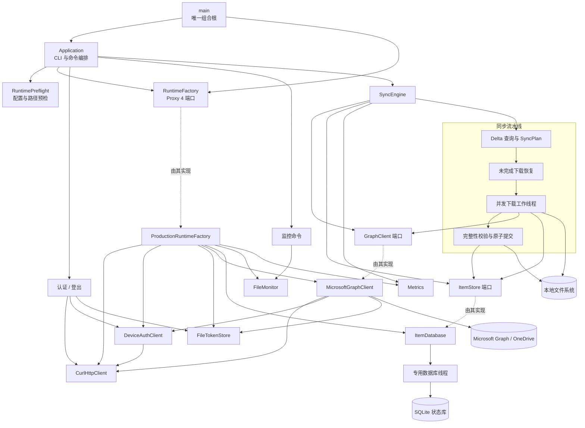

# onedrive-cpp

[English](README.md) | 简体中文

`onedrive-cpp` 是一个面向 Ubuntu 24.04 LTS 及以上版本的 C++26 OneDrive
同步客户端项目骨架。它参考
[abraunegg/onedrive](https://github.com/abraunegg/onedrive) 的职责拆分方式，
但不复制其 D 语言实现。

> 当前版本提供可编译的架构骨架、配置加载、CLI、Microsoft 设备代码认证、
> HTTP 传输层、经过认证的 Microsoft Graph Delta 查询、SQLite 远端状态和
> deltaLink 持久化、安全的单向文件下载、dry-run、systemd 用户服务和 Debian
> 打包。当前同步会创建远端目录并下载新增或修改的远端文件；上传、远端删除的
> 本地执行以及双向冲突解决尚未实现。

## 架构



应用使用构造器注入和明确的端口接口，不使用 Service Locator。`main` 是唯一的
composition root。生产 runtime factory 在配置加载后创建 libcurl、文件 token、
SQLite、monitor、Graph 和 metrics 适配器；测试则注入内存 fake。这样业务编排
不再依赖基础设施实现，并为后续 Linux metrics exporter 保留稳定端口。
运行时端口使用 Proxy 4 类型擦除，因此适配器只需满足所需操作，无需继承项目
定义的抽象基类。
SQLite ItemStore 拥有专用数据库线程。下载、监控和未来上传工作线程发起的调用
都会排队并同步等待完成，因此 SQLite 连接和事务顺序始终由一个线程负责，错误
则返回给调用方。SQLite 是状态的权威来源，适配器不再维护重复的可变条目缓存。

目录与参考项目中的 `main/config/curlEngine/onedrive/sync/itemdb/monitor`
职责相对应：

- `src/app`：CLI 解析、应用生命周期和运行时依赖工厂。
- `src/auth`：设备代码 OAuth、Token 刷新和安全持久化。
- `src/config`：配置文件加载和校验。
- `src/graph`：Microsoft Graph API 访问边界。
- `src/http`：强类型 libcurl HTTP 传输层。
- `src/storage`：ItemStore 端口，以及使用 SQLite 持久化远端 ID、ETag 与本地路径的适配器。
- `src/sync`：差异计算和同步流程编排入口。
- `src/monitor`：长驻监控模式入口。
- `src/metrics`：Metrics 端口和无操作生产适配器。
- `packaging/systemd`：systemd 用户服务。
- `debian`：Ubuntu/Debian 原生包元数据。

## 支持范围

- Ubuntu 24.04 LTS 及更新版本。
- x86_64 或 arm64（取决于 LLVM 和 Ubuntu 构建环境）。
- Clang 20，使用 `-std=c++2c`/CMake `CXX_STANDARD 26`。
- CMake 3.28 或更高版本。
- 使用系统包管理器提供 CLI11、libcurl/OpenSSL、nlohmann/json、
  spdlog/fmt、SQLite 和 toml++ 开发包。

Ubuntu 24.04 的官方仓库已经提供项目所需的 CMake、Ninja 和 Clang 20。
项目不使用默认的 GCC 13，因为它的 C++26 支持不足以满足当前配置。

## 配置构建环境

从 Ubuntu 24.04 官方仓库安装构建工具：

```bash
sudo apt update
sudo apt install -y build-essential ca-certificates curl git \
  cmake ninja-build clang-20 clang-tidy-20 zip unzip tar pkg-config \
  libcli11-dev libcurl4-openssl-dev libfmt-dev libspdlog-dev \
  libmsgsl-dev libsqlite3-dev libssl-dev libtomlplusplus-dev \
  nlohmann-json3-dev
```

确认版本：

```bash
clang++-20 --version
cmake --version
```

编译库从操作系统解析并动态链接。这样 Debian 的安全更新可以替换 libcurl、
OpenSSL、SQLite、spdlog 和 fmt，而无需重新构建 `onedrive-cpp`。
Proxy 4 是 header-only 库。CMake 优先使用已安装的 `msft_proxy4` 包，否则下载
固定版本的 ngcpp/proxy 4.1.0；vcpkg manifest 则通过 `proxy` port 解析它。

## 本地构建与测试

克隆仓库后请进入仓库根目录。以下所有构建命令均假定当前工作目录为项目根目录。

### Release 构建

```bash
cmake --preset release
cmake --build --preset release
ctest --preset release
```

生成的程序位于 `build/release/onedrive-cpp`。使用以下命令验证：

```bash
./build/release/onedrive-cpp --version
./build/release/onedrive-cpp sync --dry-run
./build/release/onedrive-cpp --help
```

### 日志

运行诊断默认以 `info` 级别写入标准错误。systemd 会自动收集该输出：

```bash
journalctl --user -u onedrive-cpp.service -f
```

每个子命令都支持诊断日志和用户输出选项：

```bash
onedrive-cpp sync --dry-run --log-level debug
onedrive-cpp monitor --log-file ~/.local/state/onedrive-cpp/onedrive-cpp.log
onedrive-cpp sync --dry-run --color always
onedrive-cpp sync --dry-run --output json
onedrive-cpp sync --dry-run --quiet
```

支持 `trace`、`debug`、`info`、`warn`、`error`、`critical` 和 `off`。
日志文件达到 5 MiB 时轮转，并保留三个旧文件。不得把认证 token、设备代码或
Authorization header 写入日志。

`--color=auto` 是默认值：仅在终端中启用样式，设置 `NO_COLOR` 时自动禁用；
`always` 强制输出 ANSI 样式，`never` 始终禁用。`--output=json` 每行输出一个
紧凑 JSON 对象且绝不包含 ANSI 序列；危险操作在该模式下必须使用 `--yes`
显式确认。`--quiet` 隐藏普通信息和成功消息，但保留警告和错误。诊断日志继续
写入标准错误，命令结果写入标准输出。

### Shell 自动补全

安装包会安装 Bash 和 Zsh 补全定义，支持子命令、选项、枚举值和文件路径。
启用 shell completion 的新终端会自动加载。

开发构建可在当前 Bash 中执行：

```bash
source packaging/completions/onedrive-cpp.bash
```

随后可以使用 Tab 补全：

```bash
build/release/onedrive-cpp <Tab>
build/release/onedrive-cpp sync --<Tab>
build/release/onedrive-cpp sync --log-level <Tab>
```

安装位置分别为 `share/bash-completion/completions/onedrive-cpp` 和
`share/zsh/vendor-completions/_onedrive-cpp`。

### 手册页

CMake 安装规则会把 section 1 手册安装到标准的 `share/man/man1` 目录。安装
DEB 包后可直接查看：

```bash
man onedrive-cpp
```

Debian 的 `man-db` trigger 会自动更新索引。直接使用 `cmake --install` 安装到
自定义前缀后，如有需要可手动刷新本地索引：

```bash
sudo mandb
```

不安装也可以查看构建目录中生成的手册：

```bash
man --local-file build/release/generated/onedrive-cpp.1
```

### 完整 Release 重编译

仅删除 Release 构建目录，使 CMake 和 Ninja 从空白状态重新配置和编译：

```bash
rm -rf build/release
cmake --preset release
cmake --build --preset release
ctest --preset release
./build/release/onedrive-cpp sync --dry-run
```

Ninja 默认自动并行编译。如需明确指定并行任务数：

```bash
cmake --build --preset release --parallel 4
```

### Debug 构建

Debug 与 Release 使用相互独立的构建目录：

```bash
rm -rf build/debug
cmake --preset debug
cmake --build --preset debug
ctest --preset debug
```

Debug 程序位于 `build/debug/onedrive-cpp`。

### C++ Core Guidelines 检查

`lint` preset 会在编译时按照项目的 `.clang-tidy` 策略运行 Clang-Tidy。
Clang 静态分析器、bug-prone、performance、portability 以及选定的 C++ Core
Guidelines 诊断都会作为构建错误：

```bash
cmake --preset lint
cmake --build --preset lint
```

策略只排除经过审查的必要 C/POSIX API、协议常量和已检查缓冲区边界噪声。
项目使用 Microsoft GSL 在 API 和 RAII 边界表达非空借用依赖，并使用
ngcpp/proxy 提供具有明确拥有/借用适配方式的类型擦除运行时端口。

## 构建 DEB 包

### 快速生成 CPack 包

使用 CPack 快速生成未经过完整 Debian 策略检查的包：

```bash
cpack --config build/release/CPackConfig.cmake -G DEB
```

生成的文件位于当前目录。CMake 会从 `/etc/os-release` 读取 `ID` 和
`VERSION_ID`，因此 Ubuntu 24.04 amd64 构建命名为：

```text
onedrive-cpp_0.5.0-1~ubuntu24.04_amd64.deb
```

在跨发行版构建环境中，可在配置时显式覆盖检测结果：

```bash
cmake --preset release \
  -DONEDRIVE_PACKAGE_DISTRIBUTION=ubuntu26.04
```

Ubuntu 26.04 包仍必须在 Ubuntu 26.04 环境中构建和测试；仅修改后缀不会改变
二进制 ABI。

### 构建正式 Debian 包

安装打包依赖：

```bash
sudo apt install -y build-essential devscripts debhelper ninja-build clang-20
```

在项目根目录执行：

```bash
source "$HOME/.profile"
chmod +x debian/rules
dpkg-buildpackage --build=binary --no-sign
```

`dpkg-buildpackage` 会执行 CMake 配置、编译和测试。生成的 `.deb` 位于项目
目录的上一级，例如：

```text
../onedrive-cpp_0.5.0-1~ubuntu24.04_amd64.deb
```

Debian changelog 保存原生构建发行版后缀。将来增加 Ubuntu 26.04 支持时，应在
Ubuntu 26.04 环境中使用 `0.5.0-1~ubuntu26.04` changelog 版本构建。

安装并检查：

```bash
version=$(dpkg-parsechangelog -S Version)
architecture=$(dpkg --print-architecture)
sudo apt install "../onedrive-cpp_${version}_${architecture}.deb"
onedrive-cpp --version
man onedrive-cpp
```

如需检查 Debian 策略问题：

```bash
sudo apt install -y lintian
lintian "../onedrive-cpp_${version}_${architecture}.changes"
```

## 配置与 systemd

默认优先读取 `~/.config/onedrive-cpp/config.toml`；文件不存在时使用内置默认值。
系统示例位于 `/etc/onedrive-cpp/onedrive-cpp.toml`。首次使用可执行：

```bash
mkdir -p ~/.config/onedrive-cpp
cp /etc/onedrive-cpp/onedrive-cpp.toml ~/.config/onedrive-cpp/config.toml
sed -i "s|/home/USER|$HOME|g" ~/.config/onedrive-cpp/config.toml
```

配置文件使用 TOML，并且必须声明 `config_version = 1`。未知配置项和错误的
值类型会直接报错，不会被静默忽略。

执行子命令前，客户端会把 `state.directory` 收紧为仅所有者可访问的 `0700`，
校验当前账号 token 路径，并在该目录持有独占的 `onedrive-cpp.lock`。第二个
使用同一状态目录的进程会立即失败。当前用户拥有的既有私有状态文件会收紧为
`0600`；符号链接或其他用户拥有的文件会被拒绝。

同步时，`sync.directory` 和 `state.directory` 不能互相包含，不能把文件系统
根目录用作同步目录，并且所有已存在的路径组件都不能是符号链接。普通同步会在
访问 Graph 前执行创建、写入、`fsync`、删除探测；dry-run 仍保持不修改同步目录。
下载会保留实际传输量 5% 或 256 MiB 中的较大值作为安全余量。并发 worker 在
传输前只预留各自尚未下载的字节，每个可靠 checkpoint 后释放对应承诺空间；当
可用容量已被其他活动下载预留时会等待。这样大批次可以顺序推进，同时不会让
并发下载过量承诺磁盘空间。

`sync.drive_id` 指定要访问的远端 OneDrive Drive。默认值 `me` 表示当前登录账号的
默认 OneDrive，程序使用 Microsoft Graph 路径 `/me/drive/root/children`
列出其根目录。若要访问账号有权使用的其他 OneDrive 或 SharePoint 文档库，
可将其设置为实际的 Drive ID；程序将改用
`/drives/<drive_id>/root/children`。例如：

```toml
[sync]
# 当前账号的默认 OneDrive
drive_id = "me"
permissions = "private"
download_concurrency = 4
download_chunk_threshold_bytes = 8388608
download_validation = "strict"

# 指定其他 OneDrive 或 SharePoint 文档库
# drive_id = "b!YOUR_DRIVE_ID"
```

`graph.endpoint` 用于选择 Microsoft Graph 云端点，默认使用全球服务，并不与
某个具体 SharePoint 主机名绑定。访问由世纪互联运营的 Microsoft 365 中国区
SharePoint 文档库时，应同时配置 Graph 和认证云端点：

```toml
[auth]
endpoint = "https://login.chinacloudapi.cn"

[graph]
endpoint = "https://microsoftgraph.chinacloudapi.cn/v1.0"
```

`download_concurrency` 控制可同时下载的文件数量，默认值为 `4`，允许范围为
`1` 到 `16`。

`download_chunk_threshold_bytes` 设置大文件阈值（字节）。超过该值的文件会通过
HTTP 字节范围请求顺序分片下载，并以该值作为单个分片的最大大小。默认值为
`8388608`（8 MiB），且必须大于零。等于或小于阈值的文件仍使用单次请求。
程序会在写入响应正文前验证 Range 响应元数据，并在大型传输过程中定期可靠
写盘和记录 checkpoint；请求中断后会从最后一个安全落盘的偏移量继续，而不是
重新下载整个分片。用户正常取消时，程序也会在停止前可靠写盘并记录已经通过
Range 响应验证的字节。

下载进度会聚合所有活动文件，并显示当前平滑传输速率和预计剩余时间；最终进度
还会显示下载总耗时。JSON 进度事件通过 `bytes_per_second`、
`estimated_seconds_remaining` 和 `elapsed_milliseconds` 提供相同指标。

`download_validation` 默认为 `"strict"`，要求下载大小以及 Graph 提供的内容哈希
与远端元数据一致。部分 SharePoint、Azure Information Protection（AIP）和
HEIC 文件实际下载的字节可能与 Graph 元数据不同；`"relaxed"` 会接受这类文件，
但会禁用断点续传、分块下载和远端大小/哈希校验。HTTP 成功状态、可靠写盘、
原子安装以及用于崩溃恢复的本地 SHA-256 指纹仍会强制执行。磁盘空间会按照
实际传输进度动态预留，而不是信任 Graph 的大小元数据；无法安全扩充预留时会
中止传输。由于 Graph 无法在下载前可靠识别 AIP 文件，宽松模式会作用于所有
下载，并会降低完整性保证。

`permissions` 默认为 `"private"`。新同步文件使用 `0600` 创建，同步根目录和
新目录会设置为 `0700`，防止本机其他用户读取同步内容。只有确实需要通过 Unix
组权限共享同步目录时，才应设置为 `"umask"`，让权限遵循进程 umask。打包的
systemd 用户服务还会使用 `UMask=0077` 作为纵深防御。

`sync.directory` 是同步数据的公共根目录。实际 Drive 内容会使用与 state 相同的
稳定 ID 和友好名称组件进行隔离：

```text
<sync.directory>/accounts/<显示名称>--<用户-ID-哈希>/
  drives/<Drive-名称>--<Drive-ID-哈希>/
    <同步的 OneDrive 内容>
```

因此，同一个配置根目录可以同时容纳多个 Microsoft 用户和多个 Drive，且不会
发生路径冲突。旧的平面 `<sync.directory>` 布局中的文件不会自动移动，并会
保持原样。

状态按稳定的 Microsoft 用户 ID 和真实 Drive ID 隔离，同时保留友好的目录名：

```text
<state.directory>/accounts/<显示名称>--<用户-ID-哈希>/
  account.json
  avatar.<图片扩展名>
  refresh_token
  drives/<Drive-名称>--<Drive-ID-哈希>/
    drive.json
    items.sqlite3
```

账号和 Drive 目录包含稳定 ID 哈希，因此显示名称改变时不会创建第二套状态目录。
Drive 数据库除远端 ID、ETag 和本地路径外，还会保存并校验用户 ID、显示名称、
真实 Drive ID、Drive 名称、头像 MIME 类型和头像二进制内容。SQLite 使用 WAL
模式。数据库中的 `drive_mapping` 表会记录配置选择器与解析结果，例如
`me` 到 Microsoft 真实 Drive ID 的映射。

旧的平面 `<state.directory>/items.sqlite3` 和
`<state.directory>/refresh_token` 布局不会自动迁移。升级后需要重新运行
`onedrive-cpp auth` 初始化账号目录，并重新建立同步状态。

### Microsoft 认证

客户端使用 OAuth 2.0 设备授权流程。必须在 Microsoft Entra 中注册自己的公共
客户端应用；不要创建客户端密钥。

#### 注册应用

Microsoft 当前要求账号具有有效的 Azure 订阅、可访问的 Microsoft Entra 租户，
并拥有注册应用的权限。如果只有 Outlook.com/Hotmail 个人账号且无法打开
**App registrations**，请先创建
[免费 Azure 账号](https://azure.microsoft.com/zh-cn/pricing/purchase-options/azure-account)，
使用其 **Default Directory**，或者请租户管理员分配 Application Developer
角色。

1. 登录 [Microsoft Entra 管理中心](https://entra.microsoft.com/)。
2. 打开 **Entra ID > 应用注册（App registrations）> 新注册
   （New registration）**。
3. 输入应用名称，例如 `onedrive-cpp`。
4. 选择支持的账号类型：
   - 如果同时支持工作/学校账号和个人 Microsoft 账号，选择
     **Any Entra ID Tenant + Personal Microsoft accounts**，并在配置中使用
     `auth.tenant_id = "common"`。
   - 如果只支持个人 Microsoft 账号，选择 **Personal accounts only**，并使用
     `auth.tenant_id = "consumers"`。
   - 如果只供一个组织使用，选择 **Single tenant**，并使用该目录的 Tenant ID。
5. 点击 **注册（Register）**。
6. 在应用的 **概述（Overview）** 页面复制 **Application (client) ID**。
   `auth.application_id` 不应填写 Object ID 或 Directory ID。
7. 打开 **身份验证（Authentication）> 高级设置（Advanced settings）**，
   将 **Allow public client flows** 设置为 **Yes** 并保存。

设备代码流不需要 Redirect URI。公共客户端中也不要添加 Client Secret，因为
桌面或命令行程序无法安全保存嵌入的客户端密钥。

对应的 Microsoft 官方文档：

- [在 Microsoft Entra ID 中注册应用](https://learn.microsoft.com/zh-cn/entra/identity-platform/quickstart-register-app)
- [配置桌面和公共客户端应用](https://learn.microsoft.com/zh-cn/entra/identity-platform/scenario-desktop-app-configuration)
- [OAuth 2.0 设备授权流程](https://learn.microsoft.com/zh-cn/entra/identity-platform/v2-oauth2-device-code)

#### 配置权限

打开 **API 权限（API permissions）> 添加权限（Add a permission）>
Microsoft Graph > 委托的权限（Delegated permissions）**。

个人 OneDrive 账号应配置以下委托权限：

```text
User.Read
Files.ReadWrite
```

`User.Read` 用于识别当前登录账号和下载头像。客户端还会请求
`offline_access`，以便 Microsoft 返回 refresh token。只有在
组织版 OneDrive、共享文档库或 SharePoint 场景确实需要时，才添加更广泛的
委托权限：

```text
Files.ReadWrite.All
Sites.ReadWrite.All
```

组织租户的策略可能要求管理员批准权限。个人 Microsoft 账号通常在设备登录时
由用户自行同意。最新权限定义请参阅
[Microsoft Graph 权限参考](https://learn.microsoft.com/zh-cn/graph/permissions-reference)。

#### 配置 onedrive-cpp

如果用户配置文件尚不存在，先创建：

```bash
mkdir -p ~/.config/onedrive-cpp
cp /etc/onedrive-cpp/onedrive-cpp.toml ~/.config/onedrive-cpp/config.toml
sed -i "s|/home/USER|$HOME|g" ~/.config/onedrive-cpp/config.toml
```

注册类型为 **仅个人 Microsoft 账号（Personal Microsoft accounts only）**
的应用使用：

```toml
[auth]
application_id = "YOUR_APPLICATION_CLIENT_ID"
tenant_id = "consumers"
endpoint = "https://login.microsoftonline.com"
scopes = ["User.Read", "Files.ReadWrite", "offline_access"]
```

如果应用注册类型为 **任何 Entra ID 租户和个人 Microsoft 账号
（Any Entra ID Tenant + Personal Microsoft accounts）**，即使本次登录使用
个人账号，也应使用 `common`：

```toml
[auth]
application_id = "YOUR_APPLICATION_CLIENT_ID"
tenant_id = "common"
endpoint = "https://login.microsoftonline.com"
scopes = ["User.Read", "Files.ReadWrite", "offline_access"]
```

单租户组织应用应将 `common` 替换为 Directory (tenant) ID。只有组织场景确实
需要时才添加 `Files.ReadWrite.All` 或 `Sites.ReadWrite.All`；
`Sites.ReadWrite.All` 不支持个人 Microsoft 账号。默认 scope 为
`User.Read Files.ReadWrite offline_access`；配置任一更广泛的组织级 scope 时，
认证会输出警告。

#### 授权客户端

使用以下命令启动设备授权：

```bash
onedrive-cpp auth
```

打开终端显示的网址，输入用户代码，使用与应用支持账号类型相符的账号登录，
并确认所请求的权限。成功后，客户端会读取稳定的用户和 Drive 身份以及头像，
并将 refresh token 和头像原子保存到友好的账号状态目录，权限限制为仅文件
所有者可访问。

如果 Microsoft 提示账号类型不受支持，请检查应用注册中的
**Supported account types**：仅个人账号注册应使用 `consumers`，同时支持个人
和组织账号的注册应使用 `common`。

如果程序显示 `https://www.microsoft.com/link`，但该页面立即提示刚生成的代码
无效或已过期，请检查是否把同时支持个人和组织账号的应用错误配置成了
`auth.tenant_id = "consumers"`。应改为：

```toml
[auth]
tenant_id = "common"
```

重新运行 `onedrive-cpp auth`，并且只在新显示的
`https://login.microsoft.com/device` 页面中使用本次新代码。之前生成的设备代码
不能重复使用。只有应用的 Supported account type 确实是
**Personal Microsoft accounts only** 时才使用 `consumers`。

如果设备代码已被接受并进入账号登录，但之后 Microsoft 又提示代码已过期，
同时终端仍停留在 `Waiting for authorization...`，应删除当前账号类型不支持的
权限。个人 Microsoft 账号应使用：

```toml
[auth]
scopes = ["User.Read", "Files.ReadWrite", "offline_access"]
```

修改权限后必须重新运行 `onedrive-cpp auth`；已有设备代码仍绑定原来的权限，
无法修复或重复使用。

使用以下命令删除已保存的认证：

```bash
onedrive-cpp logout
```

使用以下命令重置当前配置 Drive 保存的 `deltaLink`：

```bash
onedrive-cpp reset-state
```

该命令保留认证 token、配置、同步目录中的本地文件、item 快照、pending
download 恢复记录、blocked item 以及其他 Drive 的状态。下一次 `sync` 会先
恢复 pending download，再执行完整的初始 Delta 查询。同步过程中继续使用旧
快照安全判断本地文件是否被修改，并用完整远端清单替换当前 Drive 的旧 item
元数据。

如果需要丢弃当前配置 Drive 的全部同步状态，必须显式使用危险模式：

```bash
onedrive-cpp reset-state --clear-all
```

命令要求准确输入当前配置的 Drive 引用（例如 `me`），确认后才会删除 item
快照、Delta 游标、pending download 恢复记录以及 blocked item。没有可用的配置
引用时，改为要求输入原始 Drive ID。本地文件和其他 Drive 的状态不会被修改。
由于本地快照已被清除，下一次同步可能报告本地修改冲突。自动化场景必须使用
`reset-state --clear-all --yes` 显式承担该风险；未指定 `--clear-all` 时
`--yes` 会被拒绝。

`sync` 命令会刷新 OAuth access token，在 Microsoft 返回轮换后的 refresh
token 时安全持久化，并通过分页的 Microsoft Graph Delta 请求获取配置 Drive
中的递归文件树。首次成功查询会把远端元数据和最终 `deltaLink` 原子写入所选
账号和 Drive 的 `items.sqlite3`；后续运行复用该链接，只获取新增、修改和
删除的项目。仅当所有分页均成功处理后才推进 `deltaLink`，因此中途失败不会
丢失尚未应用的变更。

`--dry-run` 会查询远端变化并显示创建目录、下载文件、下载字节数和本地删除
数量，但不会创建文件或更新 SQLite 状态。普通模式会创建远端目录并下载新增
或修改的文件。下载先写入目标目录中的临时文件，完成大小校验和 `fsync` 后再
原子替换目标。每个并发 worker 会立即提交已完成文件，不会把整个批次都保留为
临时文件，因此后续独立下载失败不会丢弃已完成的传输。每个变化成功应用或在
同一 SQLite 事务中可靠记录为 blocked 后，程序才推进 `deltaLink`。系统性失败
时，已完成文件的本地快照会支持安全重试。

每个下载从准备阶段到最终 ItemStore 更新都会持有按 `(drive_id, remote_id)`
索引的 operation-coordinator 租约。同一远端条目的操作会串行执行，不同条目和
Drive 仍保持并行。未来上传、删除和重命名路径必须获取同一租约，防止一个条目的
网络、文件系统和状态变更相互交错。

程序不会覆盖无法确认未被用户修改的本地文件。下载前会记录目标是否存在、大小、
修改时间和 SHA-256 指纹，并在写 journal 前及原子替换前立即复核。下载期间创建
或修改的文件会被保留并持久化为 `local_modification` blocked item。非法远端
路径、符号链接、本地路径类型冲突、带有 Microsoft Graph `malware` facet 的文件
以及被阻塞目录的子项也会持久化为 blocked item。被标记为恶意的文件不会下载，
也不能替换已有本地数据。其他独立文件继续同步；游标安全推进后 `sync` 返回状态码
2。后续每次增量同步都会自动重试 blocked item，成功或远端删除后清除记录。认证、
Graph、数据库、同步根目录权限、整体磁盘容量和下载传输错误仍然是致命错误。当前
不会上传本地变化，也不会根据远端删除记录移除本地文件。

Microsoft Graph 提供文件内容哈希时，程序会在临时文件进入待安装 journal 前
进行校验：优先使用 SHA-256，否则校验 OneDrive/SharePoint QuickXorHash。
从 byte 0 开始的下载会在写入数据时增量计算 SHA-256 和 QuickXorHash，并将
流式 SHA-256 同时用于崩溃恢复指纹。断点续传或重试期间字节 offset 不连续时，
会安全回退到对完整文件重新计算哈希。哈希不匹配会删除 partial 检查点和临时
文件，使下次尝试从 byte 0 重新下载。本地 SHA-256 指纹仅用于保护崩溃恢复
状态，不能替代远端完整性哈希。

安装后的文件采用 Graph 权威的 `fileSystemInfo.lastModifiedDateTime`；缺少有效
权威时间的文件会在下载前被拒绝。新下载文件的权限由 `0666` 和进程 `umask`
共同决定（`umask 0022` 时通常为 `0644`），程序不会添加可执行位。

下载完成后，程序先把临时路径、目标路径、远端元数据、大小和 SHA-256 内容
指纹写入 SQLite `pending_download` journal，再执行原子替换。程序重启时会先
恢复 journal，因此 SQLite 是崩溃恢复的权威来源，不依赖目标文件系统的
扩展属性。

大文件每个 Range 分片成功并完成 `fsync` 后，还会单独持久化 SQLite
`partial_download` 检查点，其中记录远端 ETag、预期大小、目标、临时路径和已
可靠写入的字节数。只有 HTTP 状态、`Content-Range`、总大小和实际接收字节数
与请求范围完全一致时才接受分片；被拒绝的分片会回滚到前一个可靠 offset。
后续进程仅在检查点元数据和同目录普通文件仍匹配时续传；未形成检查点的尾部
字节会被截断，远端版本变化或陈旧状态则从 byte 0 重新开始。完整下载会先从
partial 状态转换到现有的待安装 journal，再进行原子替换。

Delta 查询期间，文本输出和日志会在每页处理完成后显示已完成页数和累计扫描
条目数。JSON 输出会产生包含 `pages`、`items` 和 `completed` 字段的
`delta_progress` 事件。Microsoft Graph 不会预先提供 Delta 条目总数，因此无法
显示准确百分比。`--quiet` 会隐藏控制台进度，但不会隐藏已配置的日志输出。

创建目录或下载文件之前，同步会验证每个远端路径。程序会拒绝空路径、绝对
路径、`.`/`..` 路径段、NUL、控制字节、空路径段，并根据目标文件系统限制检查
单个名称和完整路径的字节长度。错误会指出远端路径、具体问题组件、实际长度和
支持上限；控制字节会被转义，确保诊断信息可以安全显示。非法名称会保存为
blocked item，其他文件继续同步，并通常需要在 OneDrive 中重命名。

下载进度会汇总所有并发传输。文本输出显示已完成/总文件数、总体字节百分比，
以及自动使用 B、KiB、MiB 或 GiB 的传输容量。交互式终端只原位刷新一条简短
进度；重定向文本和 JSON 输出每增加一个百分点产生一条事件。JSON 事件保留精确
字节数，并包含 `completed_files`、`file_count`、`downloaded_bytes`、
`total_bytes`、`percentage` 和 `completed` 字段。`--quiet` 会隐藏进度输出。

如果 Microsoft Graph 以 `410 Gone` 拒绝已保存的 Delta 游标，同步会自动改用
完整 Delta 查询重试。已有本地快照会继续用于冲突检测；只有完整同步计划成功后，
程序才会替换已保存的游标和远端 item 清单。

`filesystem.metadata` 控制是否额外写入 `user.*` xattr：

```toml
[filesystem]
metadata = "auto"
```

- `auto`：实际创建探测文件验证 xattr；支持时写入辅助标记，不支持时自动使用
  纯 database journal。
- `xattr`：要求 xattr 支持，探测失败时同步立即停止。
- `database`：完全不读写 xattr，适合 FUSE、SMB/NFS 或其他扩展属性语义不稳定
  的文件系统。

能力判断基于目标同步目录中的实际读写探测，而不是文件系统名称白名单。

Microsoft Graph 分页请求、下载重定向、文件下载和 Range 分片请求会重试 HTTP
408、429、502、503 和 504 响应。客户端会遵循数值形式的 `Retry-After`
响应头；响应头缺失或无效时使用有上限的指数退避。如果预认证下载 URL 返回
HTTP 401 或 403，客户端会从 Graph 获取新的 redirect 并重试一次，且不会把
Graph bearer token 发给下载主机。失败的 Range 请求会先把临时文件回滚到当前
分片边界再重试。重试次数受到限制，持续服务故障会明确失败，而不是无限等待。

可在配置文件中调整节流策略：

```toml
[graph.throttle]
maximum_retries = 4
initial_delay_seconds = 1
maximum_delay_seconds = 300
```

当可重试响应没有有效的数值 `Retry-After` 时，初始等待时间会在每次重试后
加倍，直至配置的最大值。如果服务器要求的等待时间超过配置上限，客户端会
明确失败，而不是意外长时间休眠。

安装 DEB 后启用用户服务：

```bash
systemctl --user daemon-reload
systemctl --user enable --now onedrive-cpp.service
journalctl --user -u onedrive-cpp.service -f
```

当前服务运行 monitor 骨架，不会访问 OneDrive 或修改同步目录。

## 后续实现建议

1. 实现远端删除和移动在本地的安全执行。
2. 增加上传和双向冲突处理策略。
3. 使用 inotify 接入 monitor，并为 Graph 和文件系统边界增加集成测试。

## 许可证

GPL-3.0-or-later。参考项目同样采用 GPLv3，因此该许可证也便于未来在满足
许可证要求的前提下复用或改写其设计。

## 法律与品牌材料

- [服务条款](TERMS.md)
- [隐私声明](PRIVACY.md)
- 项目 Logo：[SVG](assets/onedrive-cpp-logo.svg) |
  [512x512 PNG](assets/onedrive-cpp-logo.png)

法律文件是项目维护者草案，不构成法律建议。正式公开或商业发布前，应根据
实际运营主体和适用司法管辖区进行审核。onedrive-cpp 是独立项目，与 Microsoft
不存在隶属或背书关系。
