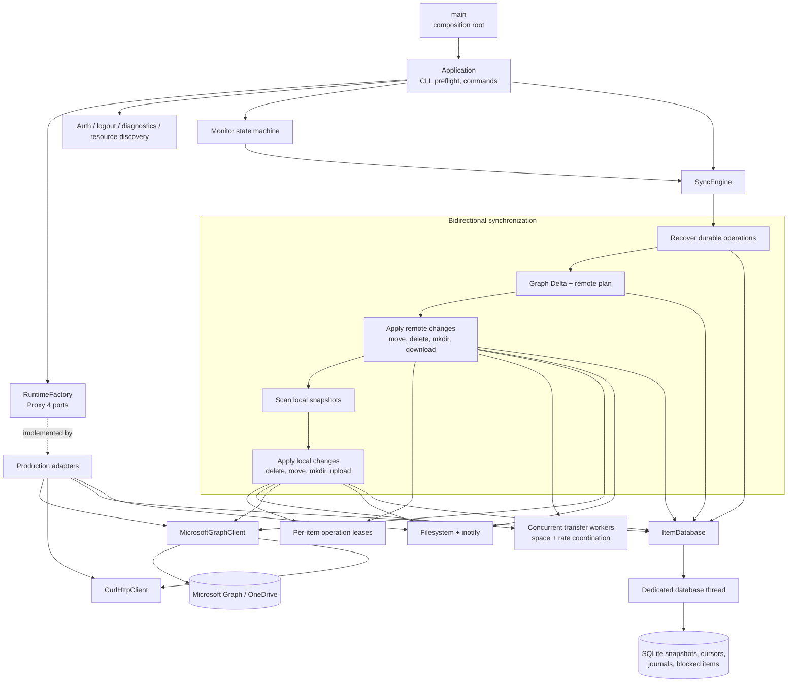

# Architecture

English | [简体中文](architecture.zh-CN.md) |
[Documentation index](README.md)

## System overview

## Dependency and storage boundaries

The application uses constructor injection and explicit port interfaces rather
than a service locator. `main` is the only composition root. The production
runtime factory creates the libcurl, file-token, SQLite, monitor, Graph, and
metrics adapters after configuration is loaded; tests inject in-memory fakes.
This keeps business orchestration and instrumentation independent of
infrastructure.
Runtime ports use Proxy 4 type erasure, so adapters satisfy the required
operations without inheriting from project-owned abstract base classes.
The SQLite ItemStore owns a dedicated database thread. Calls from download,
monitor, and upload workers are queued and completed synchronously, so
one thread owns the SQLite connection and transaction order while errors are
returned to the caller. SQLite is the authoritative state source; the adapter
does not maintain duplicate mutable item caches.

## Presentation boundary

Synchronization, upload, Delta, monitor, and command orchestration publish
typed console events through the `Console` facade. The facade serializes calls
from worker threads and forwards each event to a `ConsoleBackend`; it contains
no text or JSON rendering policy. The built-in text, JSON, and FTXUI backends render the same event model
independently, while confirmations use a separate typed request.

This boundary preserves JSON, redirected text, quiet mode, and interactive
terminal behavior without coupling business code to a specific renderer. The
account login, inspect health, inspect status, sync, download, and monitor FTXUI dashboard aggregates authorization, diagnostics, status, cloud checks, download, summary, blocked-item,
and recent-message state. It enters an alternate full-screen buffer, renders
the build version and a selectable theme, and translates transport-oriented
events into user-facing cloud activity. A centralized capability probe selects
it only for a suitable terminal; redirected, JSON, quiet, `TERM=dumb`, and
undersized sessions retain the text backend. Synchronization code never calls
terminal widgets directly.
Monitor adds stdin to its existing poll loop only while the TUI is active.
`q`, `Q`, and Escape produce the same stop transition as signals and stop
tokens, so socket shutdown, terminal restoration, and state cleanup share one
path.

## Transaction state machines

Download and upload transactions reuse a small template typestate core that
isolates state families and moves their payloads between legal phases. Download
uses content-verified and recovery-journaled phases; upload uses snapshot
prepared, journaled, and remote-committed phases, and only the journaled upload
can persist Graph session checkpoints. The shared template contains no Graph,
SQLite, or filesystem policy: typestates constrain in-process transitions while
SQLite remains the durable recovery authority.
Each transaction exposes named, exactly typed transition edges over the shared
low-level primitive. Transitions may map payload types, so later states contain
only valid data: journaled uploads no longer retain a released snapshot, and a
Graph-committed remote move owns a required remote item rather than an optional
one.
Local move recovery uses the same core for prepared, journaled, recovered-
journal, staged, and installed phases. A journal is removed on failure only
while its typed state proves that no staging or destination object was
installed; later phases retain recovery evidence across restarts.
Remote moves use a separate state family for prepared, journaled, Graph-
committed, and locally committed phases. Microsoft Graph is never called until
the move journal is durable, while a successful remote move retains that
journal until the local item state and directory descendants commit atomically.
Remote deletion follows the same durable boundary with prepared, journaled,
Graph-deleted, and locally committed states. A failed journal write cannot
reach Graph, and a completed Graph deletion retains its journal until the local
tracked subtree is removed atomically.
Remote directory creation has a separate prepared, journaled, Graph-created,
and locally committed state family. New creation and restart recovery converge
on one Graph-created commit path for local-directory validation, inode capture,
SQLite commit, and remote-identity metadata.
Graph large-file upload sessions also reuse the core outside the sync layer.
Absent or saved sessions become active only through creation or validated
resume; expired, missing, and gone saved sessions return to absent before a new
session is created. Each accepted fragment advances the active state only after
its checkpoint succeeds, and only an active session can produce a finalized
remote item.
## Notification architecture

Remote change notifications use a separate pure connection state machine from
the monitor scheduling state machine. The connection reducer owns channel
acquisition, token refresh, socket connection, lease renewal, bounded
exponential retry, and shutdown effects. A notification is only an advisory
wakeup: it never contains authoritative item data and never advances a Delta
cursor. Connecting or reconnecting schedules a catch-up Delta synchronization,
and a notification received during synchronization is latched for one
additional pass. The existing periodic Graph poll remains active as the
authoritative fallback, so channel discovery or socket failures cannot prevent
eventual convergence. Network adapters execute reducer effects; they do not
make state-transition policy. The production adapter acquires the channel
through Graph and runs Engine.IO 4 / Socket.IO framing over libcurl's
WebSocket-only transport, including heartbeat handling and eventfd wakeups.

## Source tree

The directories correspond to the responsibilities of
`main/config/curlEngine/onedrive/sync/itemdb/monitor` in the reference project:

- `src/app`: CLI parsing, application lifecycle, and runtime dependency factory.
- `src/account`: Stable account and Drive identity, metadata, and paths.
- `src/auth`: Device-code OAuth, token refresh, and secure token persistence.
- `src/cli`: Text, JSON, and FTXUI user output plus terminal capability
  detection.
- `src/config`: Configuration file loading and validation.
- `src/graph`: Microsoft Graph API boundary.
- `src/http`: Typed libcurl HTTP transport.
- `src/logging`: Runtime diagnostic logging.
- `src/storage`: Item-store port and SQLite-persisted remote ID, ETag, and local path adapter.
- `src/sync`: Planning, download, upload, filesystem, filtering, and recovery operation families.
- `src/monitor`: Long-running monitor state machine and inotify adapter.
- `src/metrics`: Metrics port and no-op production adapter.
- `packaging/systemd`: systemd user service.
- `debian`: Native Ubuntu/Debian package metadata.
