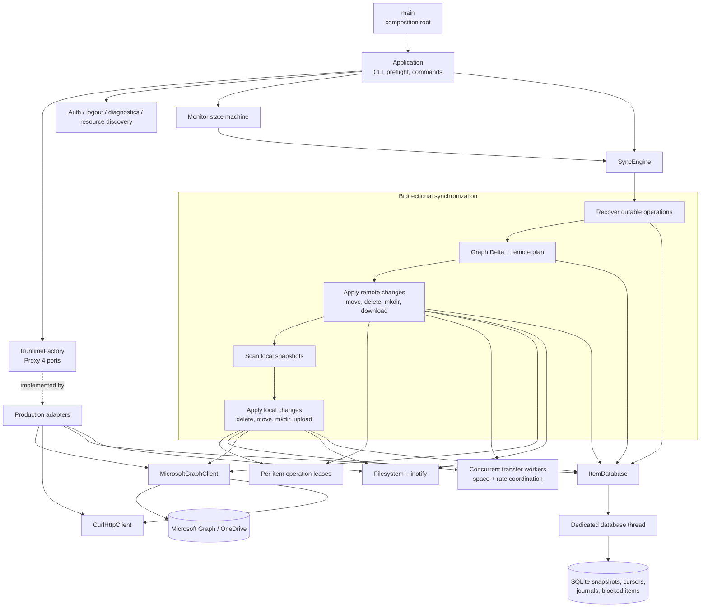

# Architecture

English | [简体中文](architecture.zh-CN.md) |
[Documentation index](README.md)

## System overview

## Dependency and storage boundaries

The application uses constructor injection and explicit port interfaces rather
than a service locator. `main` is the only composition root. The production
runtime factory creates the libcurl, file-token, SQLite, monitor, Graph, and
metrics adapters after configuration is loaded; tests inject in-memory fakes.
This keeps business orchestration and instrumentation independent of
infrastructure.
Runtime ports use Proxy 4 type erasure, so adapters satisfy the required
operations without inheriting from project-owned abstract base classes.
The SQLite ItemStore owns a dedicated database thread. Calls from download,
monitor, and upload workers are queued and completed synchronously, so
one thread owns the SQLite connection and transaction order while errors are
returned to the caller. SQLite is the authoritative state source; the adapter
does not maintain duplicate mutable item caches.

## Presentation boundary

Synchronization, upload, and Delta publish typed `events::Event` values through
the core `events::Observer` interface. It serializes callbacks from workers
without depending on a terminal or GUI toolkit. An event reference is valid only
during its callback: asynchronous frontends must copy it before posting it to
their main thread, and callbacks must not re-enter the same observer. Exceptions
propagate to the publishing caller.

`cli::Console` adapts this interface to the text, JSON, and FTXUI
`ConsoleBackend` implementations. Confirmation and terminal completion remain
CLI operations and share the same lock. Existing `cli` event names remain
aliases, preserving output fields and formats. `SyncEngine` requires an explicit,
non-null observer instead of constructing a default Console. The observer must
outlive the engine and its synchronization work.

`onedrive_core` no longer links `onedrive_cli` or FTXUI. `onedrive_cli` links the
core event implementation; `onedrive_app` temporarily links both core and CLI
because argument parsing, confirmations, and terminal lifecycle still live in
application orchestration. Extracting application services will move those CLI
entry-point responsibilities out. Terminal preferences and their parsers live
in `config`, so TOML loading does not construct or link a terminal backend.

Read-only application queries return owning snapshots before a frontend chooses
how to present them. `load_quota_snapshot` returns the Drive and raw quota
values; `load_sync_status_snapshot` returns the account, synchronization mode,
deletion policy, latest run, database summary, and WebSocket setting. The CLI
formats these snapshots into its existing section fields, while Qt and other
frontends can consume numbers, enums, and optionals without parsing English
labels or JSON output. Snapshots do not borrow Graph, SQLite, or factory
objects, so they outlive the request that created them.

`authenticate_account` provides a Console-independent authentication use case.
A synchronous callback receives an owning `DeviceAuthorization` containing the
user code, verification URL, message, and expiry, never device secrets or tokens.
Qt adapters must copy callback data before posting it to the main thread rather
than accessing widgets from the worker. Success returns the account identity and
token directory. OAuth failures and cancellation use `AuthResult`; identity,
persistence, and callback exceptions propagate to the caller.
Device-code and authorization-code implementations share a private template
pipeline for preflight, transport/client creation, token error handling, and
account activation. Each supplies its own token acquisition callback; the
runtime lock stays held throughout authorization and activation. PKCE session
failure handling remains in the authorization-code callback.

The service forwards a stop token through device authorization, polling, and
identity/photo HTTP requests. The default polling wait is interruptible; injected
test waits remain responsible for returning. A final cancellation check precedes
account activation. Once persistence begins, it is allowed to finish rather than
interrupting account file writes. CLI messages and exit codes remain unchanged;
GUI worker and window lifetimes are still the frontend's responsibility.

`SyncEngine::synchronize` and Monitor callbacks accept a stop token. A cancelled
sync returns exit code 130 and records a distinct `cancelled` outcome rather
than reporting success or an ordinary failure. Graph Delta forwards the token
through OAuth refresh, paged HTTP requests, and retry waits. Download and upload
workers bridge external stop requests to their existing worker stop sources and
join before returning. The sync plan checks cancellation at safe boundaries;
incomplete uploads retain their durable journal, and an incomplete Delta does
not advance the local cursor. Already committed individual downloads or remote
operations are not rolled back. Single Graph requests in remote-move, remote-
delete, and startup-recovery operations are not yet interruptible.

This boundary preserves JSON, redirected text, quiet mode, and interactive
terminal behavior without coupling business code to a specific renderer. The
account login, all inspect commands, and all transfer commands use the FTXUI dashboard to aggregate authorization, diagnostics, status, cloud checks, download, summary, blocked-item,
and recent-message state. It enters an alternate full-screen buffer, renders
the build version and a selectable theme, and translates transport-oriented
events into user-facing cloud activity. A centralized capability probe selects
it only for a suitable terminal; redirected, JSON, quiet, `TERM=dumb`, and
undersized sessions retain the text backend. Synchronization code never calls
terminal widgets directly.
Monitor adds stdin to its existing poll loop only while the TUI is active.
`q`, `Q`, and Escape produce the same stop transition as signals and stop
tokens, so socket shutdown, terminal restoration, and state cleanup share one
path.

## Shared directory security

Application preflight, SQLite state directories, GUI configuration directories,
and private synchronization roots share the path-based `secure_owned_directory`
helper. It opens without following any symlink component, checks ownership and
type, applies permissions through the descriptor, and reports close failures.
Callers retain their own creation, dry-run, mount, and logging policies.

## Transaction state machines

Download and upload transactions reuse a small template typestate core that
isolates state families and moves their payloads between legal phases. Download
uses content-verified and recovery-journaled phases; upload uses snapshot
prepared, journaled, and remote-committed phases, and only the journaled upload
can persist Graph session checkpoints. The shared template contains no Graph,
SQLite, or filesystem policy: typestates constrain in-process transitions while
SQLite remains the durable recovery authority.
Each transaction exposes named, exactly typed transition edges over the shared
low-level primitive. Transitions may map payload types, so later states contain
only valid data: journaled uploads no longer retain a released snapshot, and a
Graph-committed remote move owns a required remote item rather than an optional
one.
Local move recovery uses the same core for prepared, journaled, recovered-
journal, staged, and installed phases. A journal is removed on failure only
while its typed state proves that no staging or destination object was
installed; later phases retain recovery evidence across restarts.
Remote moves use a separate state family for prepared, journaled, Graph-
committed, and locally committed phases. Microsoft Graph is never called until
the move journal is durable, while a successful remote move retains that
journal until the local item state and directory descendants commit atomically.
Remote deletion follows the same durable boundary with prepared, journaled,
Graph-deleted, and locally committed states. A failed journal write cannot
reach Graph, and a completed Graph deletion retains its journal until the local
tracked subtree is removed atomically.
Remote directory creation has a separate prepared, journaled, Graph-created,
and locally committed state family. New creation and restart recovery converge
on one Graph-created commit path for local-directory validation, inode capture,
SQLite commit, and remote-identity metadata.
Graph large-file upload sessions also reuse the core outside the sync layer.
Absent or saved sessions become active only through creation or validated
resume; expired, missing, and gone saved sessions return to absent before a new
session is created. Each accepted fragment advances the active state only after
its checkpoint succeeds, and only an active session can produce a finalized
remote item.

Authorization-code PKCE sessions also use `StateTransaction` in a separate
state family: created → awaiting callback → authorized → exchanging token →
completed. The public `AuthCodeSession` API still selects states at runtime;
its private variant stores phase-specific payloads. Only the awaiting phase
owns CSRF state, and only authorized/exchanging phases own an authorization
code. Move-only secret owners keep string storage stationary during transitions
and cleanse it on consumption, termination, destruction, and exception unwinding.
Cancellation, expiry, and failure are terminal; unrelated/invalid callbacks
remain awaiting, while a server rejection with the correct CSRF state terminates.
The session and cleansing guards cannot be copied or moved. State queries and
terminal transitions use non-throwing variant access, with compile-time checks
that terminal payload assignment cannot throw. An invalid stored redirect is an
internal error: it terminates the session, cleanses its secrets, and propagates.

The GUI loopback listener uses the private, Qt-independent `BrowserRequest`
reducer for listening, reading, validation, buffered writing, and closure.
Explicit elapsed-time events enforce the 8192-byte request cap, two-second
request deadline, and bounded 100-ms reply flush. The Qt adapter executes the
read/write/close commands and retains strict QUrl target checks. HTTP/1.1 GET
and exactly one matching loopback Host are required. Invalid connections receive
400 and resume listening; accepted callbacks and terminal authorization errors
finish the flow. Qt write acceptance and actual buffer drainage are separate
events, so partial writes retain the unsent suffix.

## Notification architecture

Remote change notifications use a separate pure connection state machine from
the monitor scheduling state machine. The connection reducer owns channel
acquisition, token refresh, socket connection, lease renewal, bounded
exponential retry, and shutdown effects. A notification is only an advisory
wakeup: it never contains authoritative item data and never advances a Delta
cursor. Connecting or reconnecting schedules a catch-up Delta synchronization,
and a notification received during synchronization is latched for one
additional pass. The existing periodic Graph poll remains active as the
authoritative fallback, so channel discovery or socket failures cannot prevent
eventual convergence. Network adapters execute reducer effects; they do not
make state-transition policy. The production adapter acquires the channel
through Graph and runs Engine.IO 4 / Socket.IO framing over libcurl's
WebSocket-only transport, including heartbeat handling and eventfd wakeups.
Its private `SocketProtocol` reducer is strictly below the channel/lease reducer:
WebSocket connection, Engine.IO open, root Socket.IO readiness, and notification
namespace listening are distinct phases. Engine.IO open emits the two namespace
handshakes and the existing connected wakeup; acknowledgements do not duplicate
it. Time-bearing events drive Engine.IO heartbeat pongs and expiry, while
rejections, protocol/transport errors, and peer closure publish disconnection
once. Intentional stop closes without a disconnected wakeup. The adapter drains
libcurl chunks; text assembly survives `CURLE_AGAIN`, multi-frame messages, and
interleaved WebSocket ping/pong controls, with a one-MiB message bound.

## Source tree

The directories correspond to the responsibilities of
`main/config/curlEngine/onedrive/sync/itemdb/monitor` in the reference project:

- `src/app`: Structured application queries, runtime dependency factory, and
  preflight checks.
- `src/account`: Stable account and Drive identity, metadata, and paths.
- `src/auth`: Device-code OAuth, token refresh, and secure token persistence.
- `src/ui/common`: Shared event reporting implementation without terminal or Qt
  dependencies.
- `src/ui/cli`: Text, JSON, and FTXUI user output plus terminal capability
  detection.
- `src/ui/cli/app`: CLI argument parsing, entry-point lifecycle, command
  orchestration, and formatting. Remaining embedded use cases will move into
  `src/app` as application services are extracted.
- `src/ui/gui`: Reserved for the Qt frontend; no implementation or Qt dependency
  has been added yet.
- `include/onedrive/ui`: Public headers grouped into `common`, `cli`, and `gui`.
  Directory changes preserve the existing `events`, `cli`, and `app` namespaces.
- `src/config`: Configuration file loading and validation.
- `src/graph`: Microsoft Graph API boundary.
- `src/http`: Typed libcurl HTTP transport.
- `src/logging`: Runtime diagnostic logging.
- `src/storage`: Item-store port and SQLite-persisted remote ID, ETag, and local path adapter.
- `src/sync`: Planning, download, upload, filesystem, filtering, and recovery operation families.
- `src/monitor`: Long-running monitor state machine and inotify adapter.
- `src/metrics`: Metrics port and no-op production adapter.
- `packaging/systemd`: systemd user service.
- `debian`: Native Ubuntu/Debian package metadata.
