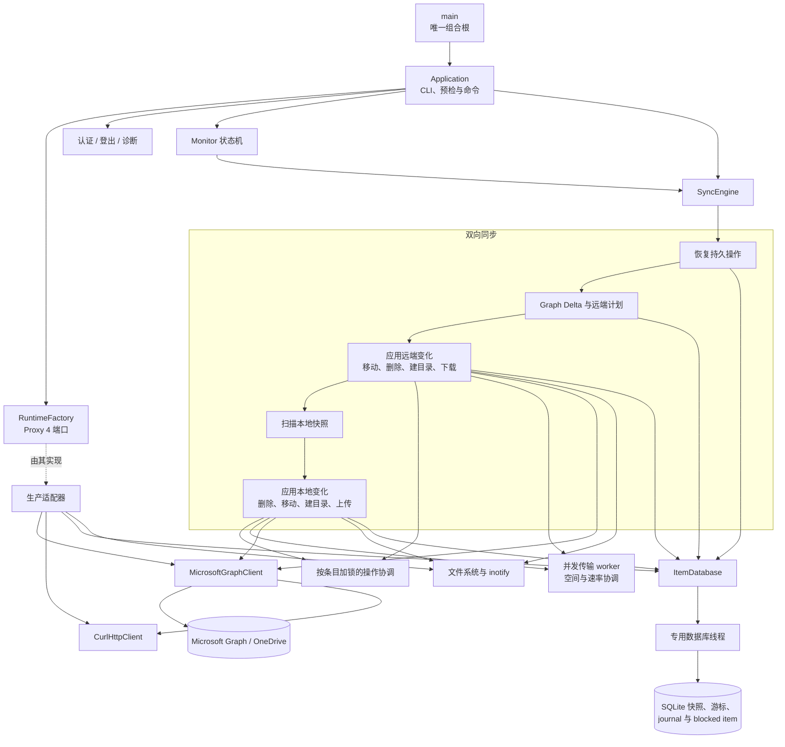

# 架构

[English](architecture.md) | 简体中文 |
[文档中心](README.zh-CN.md)

## 系统总览

## 依赖与存储边界

应用通过构造器注入依赖，并使用明确的端口接口，不采用 Service Locator。`main`
是唯一的组合根（composition root）。加载配置后，生产环境的运行时工厂
（runtime factory）会创建 libcurl、文件 token、SQLite、monitor、Graph 和
metrics 适配器；测试则注入内存实现（fake）。这样，业务编排无需依赖具体的
基础设施实现，检测逻辑（instrumentation）也能通过稳定端口与编排解耦。

运行时端口使用 Proxy 4 类型擦除。适配器只需提供所要求的操作，无需继承项目
定义的抽象基类。

SQLite ItemStore 使用专用数据库线程。下载、监控和上传工作线程发起调用后，
请求会排队，并同步等待执行结果。因此，SQLite 连接和事务顺序始终由同一线程
管理，错误则返回调用方。SQLite 是状态的权威来源，适配器不再重复维护可变的
条目缓存。

## 界面输出边界

同步、上传和 Delta 通过核心层的 `events::Observer` 发布强类型 `events::Event`。
观察者将不同 worker 线程的回调串行化，不依赖终端或任何 GUI 框架。回调接收到的
事件引用只在调用期间有效；异步前端必须复制事件后再投递到主线程，且不得在回调
内重入同一个观察者。异常会返回发布事件的调用方。

`cli::Console` 是该观察者的终端适配器，将事件交给 Text、JSON 或 FTXUI
`ConsoleBackend`；交互确认和终端结束操作仍属于 CLI，并使用同一把锁。现有
`cli` 事件类型名保留为别名，输出字段和格式不变。`SyncEngine` 要求调用方显式
传入非空观察者，不再自行构造默认 Console；观察者必须比引擎及其同步任务活得更久。

构建层面，`onedrive_core` 不再依赖 `onedrive_cli` 或 FTXUI。`onedrive_cli`
链接核心事件实现，`onedrive_app` 暂时同时链接核心和 CLI，因为参数解析、确认和
终端生命周期仍在应用编排中。下一阶段提取应用服务后，再将这些 CLI 入口职责移出。
配置中的终端偏好类型和解析位于 `config`，加载 TOML 不会构造或链接终端后端。

只读应用查询返回拥有数据的快照，再由前端决定展示方式。
`load_quota_snapshot` 返回 Drive 与原始配额数值；
`load_sync_status_snapshot` 返回账号、同步模式、删除策略、最近同步结果、数据库
摘要和 WebSocket 配置。CLI 将这些快照格式化为原有 section 字段，Qt 等前端可以
直接使用数值、枚举和可选值，不需要解析英文标签或 JSON 输出。快照不借用 Graph、
SQLite 或工厂对象，其生命周期与创建它的请求独立。

`authenticate_account` 是不依赖 Console 的认证应用服务。它通过同步回调提供
拥有数据的 `DeviceAuthorization`（用户验证码、验证网址、消息和有效期），不向
前端暴露设备密钥或 Token。Qt 适配器应复制回调数据并投递到主线程，不得在 worker
回调中直接操作控件。成功结果包含账号身份和 Token 目录；OAuth 错误及取消通过
`AuthResult` 返回，身份解析、持久化和回调异常继续传播给调用方。

认证服务将 stop token 传入设备码请求、轮询和身份/头像 HTTP 请求。默认轮询等待
可立即被停止请求唤醒；注入的测试等待函数仍由调用方负责返回。账号激活前做最后一次
取消检查，进入持久化阶段后不再中途打断账号文件写入。CLI 保持原有授权消息和退出码，
GUI 线程与窗口生命周期管理仍须由未来前端实现。

`SyncEngine::synchronize` 和 `Monitor` 回调接受 stop token。同步取消会作为退出码
130 返回，并以 `cancelled` 记录运行指标，不会把取消报告为成功或普通失败。Graph
Delta 会将 token 传给 OAuth 刷新、分页 HTTP 请求和重试等待；下载与上传 worker 会将
外部停止请求桥接到现有 worker stop source，等待 worker 收尾后返回。同步计划在安全
边界检查取消；未完成的上传继续保留持久化 journal，未完成 Delta 不推进本地游标。
已经提交的单个下载或远端变化不会回滚。远端删除、移动及恢复阶段的单个 Graph 请求
目前仍不可中断；Qt 前端应在 UI 中区分“正在停止”和“已停止”。

这条边界在保留 JSON、重定向文本、quiet 模式和交互式终端行为的同时，让业务
代码不再依赖具体渲染器。内置 Text、JSON 与 FTXUI backend 独立消费同一套事件。
`account login`、全部 `inspect` 命令和全部 `transfer` 命令使用 FTXUI 面板聚合认证、诊断、状态、云端检查、下载、摘要、阻塞项和最近消息；它
使用全屏备用缓冲区，显示构建版本和可选主题，并把传输层事件翻译成面向用户的云端
活动。集中式能力探测只在终端合适时选择它。重定向、JSON、quiet、`TERM=dumb`
和窗口过小的场景继续使用 Text backend，同步逻辑始终无需直接调用终端控件。
仅在 TUI 活跃时，Monitor 才会把 stdin 加入已有的 poll 循环；`q`、`Q` 和
`Esc` 与信号、stop token 共用同一停止转换，因此 socket 关闭、终端恢复和状态
清理不会产生旁路。

## 事务状态机

下载和上传事务共用一个小型的模板化类型状态（Typestate）核心。它将不同状态族
彼此隔离，并确保载荷（payload）只能在合法阶段之间移动。下载事务包括“内容已
验证”和“恢复日志已持久化”阶段；上传事务包括“快照已准备”“日志已持久化”和
“远端已提交”阶段。只有已写入日志的上传才能持久化 Graph 会话检查点。

公共模板不包含 Graph、SQLite 或文件系统策略。Typestate 只约束进程内的状态
转换，SQLite 仍是持久化恢复状态的权威来源。每种事务都基于公共底层原语提供
精确类型的命名转换。转换时可以映射 payload 类型，因此后续状态只保留有效数据：
已写入日志的上传不再携带已经释放的快照；Graph 已提交的远端移动直接持有必需的
远端条目，而不是可选值。

本地移动恢复也复用该核心，用于表达 prepared、journaled、恢复 journal、staged
和 installed 阶段。只有类型状态能够证明尚未生成 staging 或目标对象时，失败
路径才会删除 journal；进入后续阶段后，系统始终保留恢复证据，以供重启时使用。

远端移动使用独立的状态族，依次表达 prepared、journaled、Graph 已提交和本地
已提交阶段。只有 journal 持久化后才能调用 Microsoft Graph。远端移动成功后，
journal 仍会保留，直到本地条目状态和目录后代路径完成原子提交。

远端删除同样使用 prepared、journaled、Graph 已删除和本地已提交状态。如果
journal 写入失败，程序不会调用 Graph；Graph 完成删除后，journal 仍会保留，
直到本地跟踪子树完成原子删除。

远端目录创建使用另一套独立的 prepared、journaled、Graph 已创建和本地已提交
状态。新建操作与重启恢复会汇入同一条“Graph 已创建”提交路径，共用本地目录
验证、inode 获取、SQLite 提交和远端身份 metadata 写入逻辑。

Graph 大文件上传会话也在同步层之外复用这一核心。不存在或已保存的会话只能
通过“创建”或“验证并恢复”进入 active 状态。对于已过期、不存在或失效的已保存
会话，程序先返回 absent，再创建新会话。每个已接受的分片只有在 checkpoint
成功后才会推进 active 状态；也只有 active 会话能够生成包含远端条目的
finalized 状态。

授权码 PKCE 会话也使用独立状态族的 `StateTransaction`：
created → awaiting callback → authorized → exchanging token → completed。
公开的 `AuthCodeSession` API 仍在运行时选择状态；私有 variant 持有各阶段专属
载荷。只有 awaiting 阶段持有 CSRF state，只有 authorized/exchanging 阶段持有
授权码。仅可移动的秘密所有者让字符串存储在状态转换时保持原址，并在消费、
终止、析构和异常展开时清零。取消、过期和失败均为终态；无关或无效回调继续等待，
携带正确 CSRF state 的授权服务器拒绝则终止会话。

GUI loopback 监听器通过私有、独立于 Qt 的 `BrowserRequest` 归约器管理
listening、reading、validating、writing 和 closed 生命周期。显式时间事件约束
8192 字节请求上限、两秒请求期限和有界的 100 毫秒回复排空。Qt 适配器执行
读写与关闭命令，并保留严格的 QUrl 目标检查。请求必须使用 HTTP/1.1 GET，
且恰好包含一个匹配 loopback 的 Host。无效连接收到 400 后继续监听；
有效回调和授权终态错误结束流程。Qt 写入缓冲区的接受量与实际排空分别建模，
部分写入会保留尚未接受的后缀。

## 通知架构

远端变更通知使用纯连接状态机，与 Monitor 的调度状态机相互独立。连接归约器
（reducer）负责获取 channel、刷新 token、建立 socket 连接、续订租约、执行
有界指数退避，以及产生停止 effect。

通知只是一种唤醒信号：它不含权威条目数据，也不会推进 Delta cursor。首次连接
或重连后，必须安排一次补偿性（catch-up）Delta 同步。同步期间收到的通知会先
锁存，待当前同步完成后再执行一轮。原有的 Graph 定时轮询始终作为权威后备机制
（fallback）启用，因此，即使 channel 发现或 socket 出现故障，系统仍能最终
收敛。

网络适配器只执行 reducer 产生的 effect，不负责决定状态转换策略。生产适配器
通过 Graph 获取 channel，并基于 libcurl 的纯 WebSocket 传输实现 Engine.IO 4 /
Socket.IO framing、心跳处理和 eventfd 唤醒。
其私有 `SocketProtocol` 归约器严格位于 channel/租约归约器下层，不负责重试、
续订或 token 刷新。WebSocket 已连接、Engine.IO open、根 Socket.IO ready 与
通知 namespace listening 是不同阶段。Engine.IO open 产生两条 namespace
握手命令及原有的 connected 唤醒；ack 不会重复发布 connected。携带时间的事件
驱动 Engine.IO 心跳 pong 和过期；拒绝、协议/传输错误与对端关闭只发布一次
disconnected，主动停止则关闭而不发布断线唤醒。适配器排空 libcurl 数据块；
文本重组可跨越 `CURLE_AGAIN`、多个 WebSocket frame 以及穿插的 WebSocket
ping/pong 控制帧，完整消息限制为一 MiB。

## 源码目录

目录与参考项目中的 `main/config/curlEngine/onedrive/sync/itemdb/monitor`
职责相对应：

- `src/app`：结构化应用查询、运行时依赖工厂和预检。
- `src/account`：稳定账号与 Drive 身份、元数据和路径。
- `src/auth`：设备代码 OAuth、Token 刷新和安全持久化。
- `src/ui/common`：前端共用的事件报告实现，不依赖终端或 Qt。
- `src/ui/cli`：文本、JSON、FTXUI 用户输出及终端能力探测。
- `src/ui/cli/app`：CLI 参数解析、入口生命周期、命令编排和输出格式化；
  其中尚未提取的业务用例仍会在后续迁入 `src/app`。
- `src/ui/gui`：为 Qt 前端预留的目录，目前不包含实现或 Qt 依赖。
- `include/onedrive/ui`：按 `common`、`cli`、`gui` 对应组织的公共头文件；
  文件归属调整不改变现有 `events`、`cli` 和 `app` 命名空间。
- `src/config`：配置文件加载和校验。
- `src/graph`：Microsoft Graph API 访问边界。
- `src/http`：强类型 libcurl HTTP 传输层。
- `src/logging`：运行时诊断日志。
- `src/storage`：ItemStore 端口，以及使用 SQLite 持久化远端 ID、ETag 与本地路径的适配器。
- `src/sync`：计划、下载、上传、文件系统、筛选和恢复操作族。
- `src/monitor`：长驻监控状态机和 inotify 适配器。
- `src/metrics`：Metrics 端口和无操作生产适配器。
- `packaging/systemd`：systemd 用户服务。
- `debian`：Ubuntu/Debian 原生包元数据。
