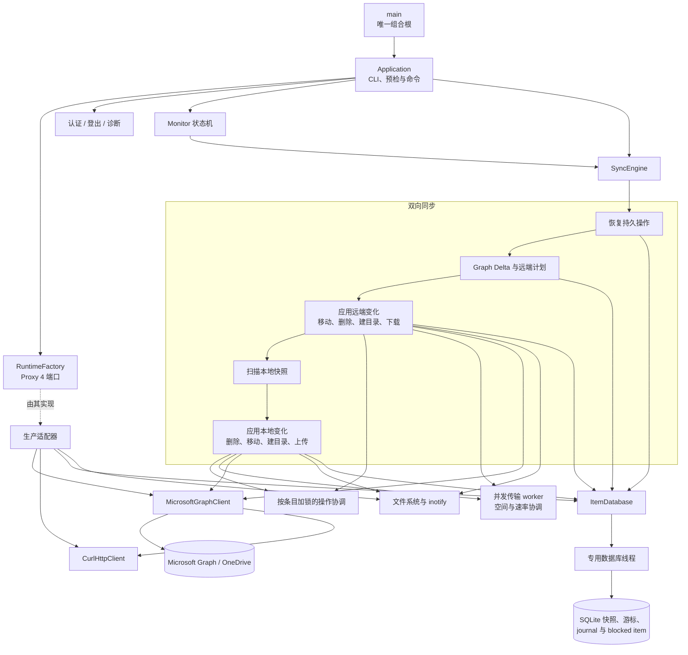

# 架构

[English](architecture.md) | 简体中文

应用使用构造器注入和明确的端口接口，不使用 Service Locator。`main` 是唯一的
composition root。生产 runtime factory 在配置加载后创建 libcurl、文件 token、
SQLite、monitor、Graph 和 metrics 适配器；测试则注入内存 fake。这样业务编排
不再依赖基础设施实现，instrumentation 也通过稳定端口与编排解耦。
运行时端口使用 Proxy 4 类型擦除，因此适配器只需满足所需操作，无需继承项目
定义的抽象基类。
SQLite ItemStore 拥有专用数据库线程。下载、监控和上传工作线程发起的调用
都会排队并同步等待完成，因此 SQLite 连接和事务顺序始终由一个线程负责，错误
则返回给调用方。SQLite 是状态的权威来源，适配器不再维护重复的可变条目缓存。
下载和上传事务复用一个小型模板 Typestate 核心，用于隔离状态族并在合法阶段间
移动 payload。下载包含内容已验证和恢复 journal 已持久化阶段；上传包含快照已
准备、journal 已持久化和远端已提交阶段，并且只有 journaled 上传可以持久化
Graph 会话 checkpoint。公共模板不包含 Graph、SQLite 或文件系统策略：Typestate
负责约束进程内转换，SQLite 仍然是持久化恢复的权威来源。
每种事务都在公共底层原语之上提供精确类型的命名转换边。转换可以映射 payload
类型，因此后续状态只保存有效数据：journaled 上传不再携带已释放的 snapshot，
Graph 已提交的远端移动直接拥有必需的远端条目，而不是 optional 值。
本地移动恢复也复用该核心，表达 prepared、journaled、恢复 journal、staged 和
installed 阶段。只有类型状态能够证明尚未生成 staging 或目标对象时，失败路径
才会删除 journal；后续阶段始终保留恢复证据供重启使用。
远端移动使用独立状态族表达 prepared、journaled、Graph 已提交和本地已提交阶段。
只有 journal 持久化后才能调用 Microsoft Graph；远端移动成功后仍保留 journal，
直到本地条目状态和目录后代路径完成原子提交。
远端删除同样使用 prepared、journaled、Graph 已删除和本地已提交状态。journal
写入失败时不能调用 Graph；Graph 删除完成后继续保留 journal，直到本地跟踪子树
完成原子删除。
远端目录创建使用独立的 prepared、journaled、Graph 已创建和本地已提交状态族。
新建和重启恢复统一进入同一个 Graph 已创建提交路径，复用本地目录验证、inode
获取、SQLite 提交和远端身份 metadata 写入。
Graph 大文件上传会话也在同步层之外复用此核心。不存在或已保存的会话只能通过
创建或验证恢复进入 active；已过期、不存在或已失效的保存会话先返回 absent，
再创建新会话。每个已接受的分片只有在 checkpoint 成功后才推进 active 状态，
并且只有 active 会话能够生成包含远端条目的 finalized 状态。
远端变更通知使用独立于 Monitor 调度状态机的纯连接状态机。连接 reducer 负责
channel 获取、token 刷新、socket 连接、租约续期、有界指数退避和停止 effect。
通知只是唤醒信号：它不包含权威条目数据，也不会推进 Delta cursor。首次连接或
重连后必须安排一次 catch-up Delta 同步；同步期间收到通知时会锁存，并在完成后
再执行一轮。原有 Graph 定时轮询始终作为权威 fallback 保持启用，因此 channel
发现或 socket 故障不会阻止最终收敛。网络 adapter 只执行 reducer effect，不
决定状态转移策略。生产 adapter 通过 Graph 获取 channel，并在 libcurl 的纯
WebSocket transport 上执行 Engine.IO 4 / Socket.IO framing、心跳处理和 eventfd
唤醒。

目录与参考项目中的 `main/config/curlEngine/onedrive/sync/itemdb/monitor`
职责相对应：

- `src/app`：CLI 解析、应用生命周期和运行时依赖工厂。
- `src/account`：稳定账号与 Drive 身份、元数据和路径。
- `src/auth`：设备代码 OAuth、Token 刷新和安全持久化。
- `src/cli`：文本和 JSON 用户输出。
- `src/config`：配置文件加载和校验。
- `src/graph`：Microsoft Graph API 访问边界。
- `src/http`：强类型 libcurl HTTP 传输层。
- `src/logging`：运行时诊断日志。
- `src/storage`：ItemStore 端口，以及使用 SQLite 持久化远端 ID、ETag 与本地路径的适配器。
- `src/sync`：计划、下载、上传、文件系统、筛选和恢复操作族。
- `src/monitor`：长驻监控状态机和 inotify 适配器。
- `src/metrics`：Metrics 端口和无操作生产适配器。
- `packaging/systemd`：systemd 用户服务。
- `debian`：Ubuntu/Debian 原生包元数据。
