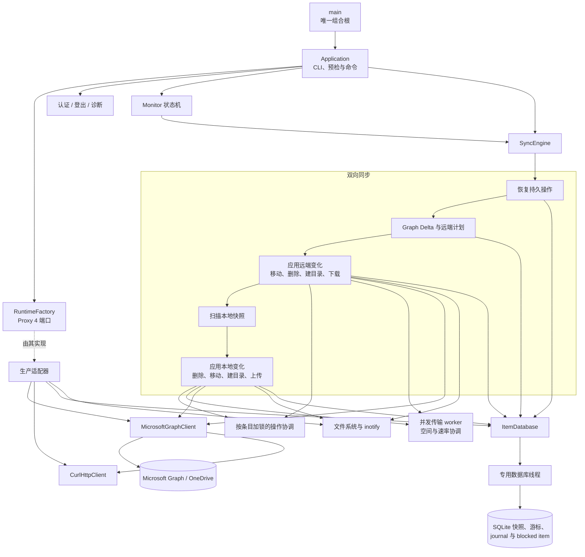

# 架构

[English](architecture.md) | 简体中文 |
[文档中心](README.zh-CN.md)

## 系统总览

## 依赖与存储边界

应用通过构造器注入依赖，并使用明确的端口接口，不采用 Service Locator。`main`
是唯一的组合根（composition root）。加载配置后，生产环境的运行时工厂
（runtime factory）会创建 libcurl、文件 token、SQLite、monitor、Graph 和
metrics 适配器；测试则注入内存实现（fake）。这样，业务编排无需依赖具体的
基础设施实现，检测逻辑（instrumentation）也能通过稳定端口与编排解耦。

运行时端口使用 Proxy 4 类型擦除。适配器只需提供所要求的操作，无需继承项目
定义的抽象基类。

SQLite ItemStore 使用专用数据库线程。下载、监控和上传工作线程发起调用后，
请求会排队，并同步等待执行结果。因此，SQLite 连接和事务顺序始终由同一线程
管理，错误则返回调用方。SQLite 是状态的权威来源，适配器不再重复维护可变的
条目缓存。

## 界面输出边界

同步、上传、Delta、monitor 和命令编排都通过 `Console` facade 发布强类型界面
事件。facade 会将不同 worker 线程的调用串行化，再把事件交给
`ConsoleBackend`；它自身不负责文本或 JSON 的渲染策略。内置 Text 与 JSON
backend 分别消费同一套事件，交互确认则使用独立的强类型请求。

这条边界在保留 JSON、重定向文本、quiet 模式和交互式终端行为的同时，让业务
代码不再依赖具体渲染器。内置 Text、JSON 与 FTXUI backend 独立消费同一套事件。
用于 `auth`、`doctor`、`status`、`sync`、`download` 和 `monitor` 的 FTXUI 面板会聚合认证、诊断、状态、云端检查、下载、摘要、阻塞项和最近消息；它
使用全屏备用缓冲区，显示构建版本和可选主题，并把传输层事件翻译成面向用户的云端
活动。集中式能力探测只在终端合适时选择它。重定向、JSON、quiet、`TERM=dumb`
和窗口过小的场景继续使用 Text backend，同步逻辑始终无需直接调用终端控件。
仅在 TUI 活跃时，Monitor 才会把 stdin 加入已有的 poll 循环；`q`、`Q` 和
`Esc` 与信号、stop token 共用同一停止转换，因此 socket 关闭、终端恢复和状态
清理不会产生旁路。

## 事务状态机

下载和上传事务共用一个小型的模板化类型状态（Typestate）核心。它将不同状态族
彼此隔离，并确保载荷（payload）只能在合法阶段之间移动。下载事务包括“内容已
验证”和“恢复日志已持久化”阶段；上传事务包括“快照已准备”“日志已持久化”和
“远端已提交”阶段。只有已写入日志的上传才能持久化 Graph 会话检查点。

公共模板不包含 Graph、SQLite 或文件系统策略。Typestate 只约束进程内的状态
转换，SQLite 仍是持久化恢复状态的权威来源。每种事务都基于公共底层原语提供
精确类型的命名转换。转换时可以映射 payload 类型，因此后续状态只保留有效数据：
已写入日志的上传不再携带已经释放的快照；Graph 已提交的远端移动直接持有必需的
远端条目，而不是可选值。

本地移动恢复也复用该核心，用于表达 prepared、journaled、恢复 journal、staged
和 installed 阶段。只有类型状态能够证明尚未生成 staging 或目标对象时，失败
路径才会删除 journal；进入后续阶段后，系统始终保留恢复证据，以供重启时使用。

远端移动使用独立的状态族，依次表达 prepared、journaled、Graph 已提交和本地
已提交阶段。只有 journal 持久化后才能调用 Microsoft Graph。远端移动成功后，
journal 仍会保留，直到本地条目状态和目录后代路径完成原子提交。

远端删除同样使用 prepared、journaled、Graph 已删除和本地已提交状态。如果
journal 写入失败，程序不会调用 Graph；Graph 完成删除后，journal 仍会保留，
直到本地跟踪子树完成原子删除。

远端目录创建使用另一套独立的 prepared、journaled、Graph 已创建和本地已提交
状态。新建操作与重启恢复会汇入同一条“Graph 已创建”提交路径，共用本地目录
验证、inode 获取、SQLite 提交和远端身份 metadata 写入逻辑。

Graph 大文件上传会话也在同步层之外复用这一核心。不存在或已保存的会话只能
通过“创建”或“验证并恢复”进入 active 状态。对于已过期、不存在或失效的已保存
会话，程序先返回 absent，再创建新会话。每个已接受的分片只有在 checkpoint
成功后才会推进 active 状态；也只有 active 会话能够生成包含远端条目的
finalized 状态。
## 通知架构

远端变更通知使用纯连接状态机，与 Monitor 的调度状态机相互独立。连接归约器
（reducer）负责获取 channel、刷新 token、建立 socket 连接、续订租约、执行
有界指数退避，以及产生停止 effect。

通知只是一种唤醒信号：它不含权威条目数据，也不会推进 Delta cursor。首次连接
或重连后，必须安排一次补偿性（catch-up）Delta 同步。同步期间收到的通知会先
锁存，待当前同步完成后再执行一轮。原有的 Graph 定时轮询始终作为权威后备机制
（fallback）启用，因此，即使 channel 发现或 socket 出现故障，系统仍能最终
收敛。

网络适配器只执行 reducer 产生的 effect，不负责决定状态转换策略。生产适配器
通过 Graph 获取 channel，并基于 libcurl 的纯 WebSocket 传输实现 Engine.IO 4 /
Socket.IO framing、心跳处理和 eventfd 唤醒。

## 源码目录

目录与参考项目中的 `main/config/curlEngine/onedrive/sync/itemdb/monitor`
职责相对应：

- `src/app`：CLI 解析、应用生命周期和运行时依赖工厂。
- `src/account`：稳定账号与 Drive 身份、元数据和路径。
- `src/auth`：设备代码 OAuth、Token 刷新和安全持久化。
- `src/cli`：文本、JSON、FTXUI 用户输出及终端能力探测。
- `src/config`：配置文件加载和校验。
- `src/graph`：Microsoft Graph API 访问边界。
- `src/http`：强类型 libcurl HTTP 传输层。
- `src/logging`：运行时诊断日志。
- `src/storage`：ItemStore 端口，以及使用 SQLite 持久化远端 ID、ETag 与本地路径的适配器。
- `src/sync`：计划、下载、上传、文件系统、筛选和恢复操作族。
- `src/monitor`：长驻监控状态机和 inotify 适配器。
- `src/metrics`：Metrics 端口和无操作生产适配器。
- `packaging/systemd`：systemd 用户服务。
- `debian`：Ubuntu/Debian 原生包元数据。
